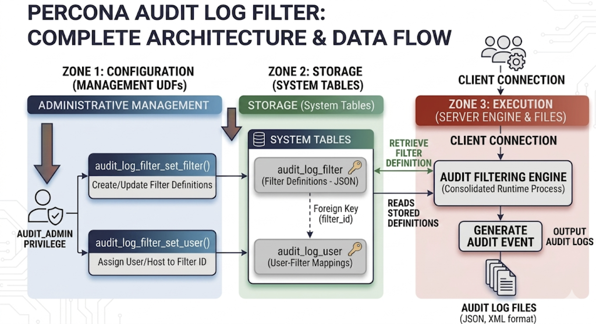
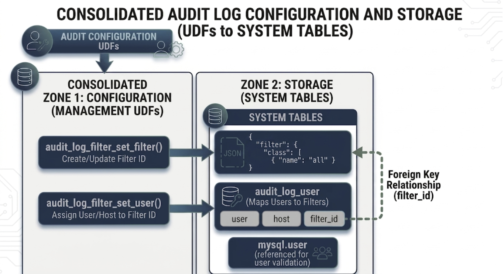
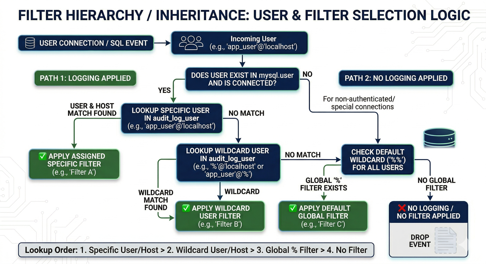

# Audit Log Filter overview

The Audit Log Filter component audits activity on the server you configure by recording events to a log. Filtering rules control which events are written. Events that match a rule's `log` condition are recorded; everything else is skipped and never reaches the log.

With the component enabled, the server can capture who connected, which statements ran, and which schemas sessions touched — subject to those filter rules.

## Architecture

The following diagram shows how the Audit Log Filter component sits between the server core, your filter rules, and audit output.

### Why the filter component

The component replaces the [legacy audit log plugin](audit-log-plugin.md). The design centers on three goals that the plugin could not meet:

* Change rules without restarting the server. Filter definitions and account assignments live in `mysql` system tables. Updates via [`audit_log_filter_set_filter()`](audit-log-filter-variables.md) and [`audit_log_filter_set_user()`](audit-log-filter-variables.md) take effect on new sessions (and reloads) without bouncing the server. The legacy plugin required `audit_log_*` system-variable changes that often meant a restart or plugin reinstall to adjust scope.

* Scope audits per account, not globally. Each row in `mysql.audit_log_user` binds a user or user-pattern to a named filter, so `admin@%` and `app@%` can be audited differently on the same instance. The legacy plugin offered only global include/exclude lists (`audit_log_include_accounts` / `audit_log_exclude_accounts`) on top of a single policy preset.

* Express rules as data, not as knob settings. Filter definitions are JSON documents. A rule can match an event, a class, a subclass, or a specific field value; combine matches with `and` / `or` / `not`; call predefined variables and functions; use `log` conditions to write or skip each event; and redact statement text in place with `print` / `replace`. The legacy plugin had policy presets (`LOGINS`, `QUERIES`, `ALL`, …) with far coarser control and no per-event skip logic or redaction.

A secondary benefit falls out of the design: events that a filter skips never reach the formatter or the writer, so the cost of "audit everything, then throw most of it away" is avoided at the source. Combined with per-account scoping, this lets operators raise audit detail on sensitive accounts without paying for verbose logging elsewhere.

See [Write audit_log_filter definitions](write-filter-definitions.md) for the JSON grammar, [Block statements with an audit log filter](block-statements-with-audit-filter.md) for `abort`, and [Redact audit log fields](redact-audit-log-fields.md) for `print` / `replace`.

## Audit data flow

The following diagram traces audit events from the server through filtering and formatting into the log (file, syslog, or another handler).

Set [`audit_log_filter.format`](audit-log-filter-variables.md#audit_log_filterformat) at startup. [Audit Log Filter file format overview](audit-log-filter-formats.md) compares NEW (the default in Percona Server 8.4), OLD, JSON, and JSONL.

[`audit_log_filter.event_mode`](audit-log-filter-variables.md#audit_log_filterevent_mode) selects which event classes the component audits (default `REDUCED`; `FULL` enables every class the component supports, including beyond the four core classes). That reference lists full class sets, validation rules, and behavior on older releases.

The component stores filter definitions and account assignments in the `mysql` system database. Set [`audit_log_filter.database`](audit-log-filter-variables.md#audit_log_filterdatabase) at startup to use a different database.

You need `AUDIT_ADMIN` to administer the Audit Log Filter component.

## Privileges

Define the privilege at server startup. If the component is not loaded, the server does not expose the Audit Log Filter privilege.

### `AUDIT_ADMIN`

The server defines `AUDIT_ADMIN` so grantees can configure the component.

### `AUDIT_ABORT_EXEMPT`

A filter may include an `abort` rule that blocks matching statements. To bypass those aborts, an account needs both `SYSTEM_USER` and the global `AUDIT_ABORT_EXEMPT` privilege (granted on `*.*`).

Only that pair lets matching statements run when a filter would otherwise abort them. The component still writes those statements to the audit log.

## Audit Log Filter tables

The Audit Log Filter component uses `mysql` system tables on `InnoDB`. They hold account assignments and filter JSON. Point the component at another database with `audit_log_filter.database` when the server starts.

The `audit_log_filter` table stores named filter definitions:

| Column name | Description                                                   |
|-------------|---------------------------------------------------------------|
| NAME        | Filter name                                            |
| FILTER      | JSON filter definition linked to that name  |

The `audit_log_user` table maps accounts to filters:

| Column name  | Description                         |
|--------------|-------------------------------------|
| USER         | MySQL account user part        |
| HOST         | MySQL account host part        |
| FILTERNAME   | Name of the assigned filter             |

### Filter storage hierarchy

The following diagram shows how rows in `audit_log_filter` map to `audit_log_user`, including the default `%` account.

On connect, the component loads one filter definition from the matching `USER`/`HOST` row in `mysql.audit_log_user`, or falls back to the default account (`%`). A concrete account (for example `admin`@`localhost`) overrides a `%` assignment. Rules inside that filter's JSON (for example `log` conditions that test `user.str` or `host.str` with `field` items) apply after load — they narrow which events get written, but do not act as a second assigned filter. See [Filter the Audit Log Filter logs](filter-audit-log-filter-files.md#using-the-audit-log-filter-functions) for assignment order and wildcards, and [Write audit_log_filter definitions](write-filter-definitions.md#test-event-field-values) for the JSON grammar that `log` conditions use.

## Additional reading

* [Install the audit log filter](install-audit-log-filter.md)
* [Audit Log Filter quickstart](audit-log-filter-quickstart.md)
* [Audit log filter functions, options, and variables](audit-log-filter-variables.md)
* [Write audit_log_filter definitions](write-filter-definitions.md)
* [Filter the Audit Log Filter logs](filter-audit-log-filter-files.md)
* [Audit Log Filter file format overview](audit-log-filter-formats.md)
* [Migrate to the audit log filter component](migrate-to-audit-log-filter-component.md) — coming from either audit plugin: variable mapping, policy translation, worked example, cutover
* [Upgrade components](upgrade-components.md) — general plugin-to-component transition procedure
* [Audit log plugin](audit-log-plugin.md) — deprecated plugin reference
