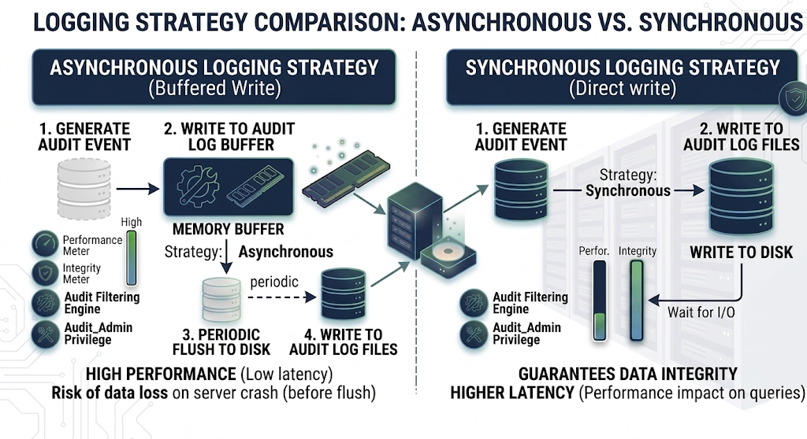

# Audit log filter functions, options, and variables

Reference for audit log filter [functions](#audit-log-filter-functions) and [options / variables](#audit-log-filter-options-and-variables).

## Audit log filter functions

Available UDFs:

| Function name |
| --- | 
| [audit_log_encryption_password_get(keyring_id)](#audit_log_encryption_password_getkeyring_id) |
| [audit_log_encryption_password_set(new_password)](#audit_log_encryption_password_setnew_password) |
| [audit_log_filter_flush()](#audit_log_filter_flush) |
| [audit_log_read()](#audit_log_read) |
| [audit_log_read_bookmark()](#audit_log_read_bookmark) |
| [audit_log_session_filter_id()](#audit_log_session_filter_id)|
| [audit_log_filter_remove_filter(filter_name)](#audit_log_filter_remove_filterfilter_name) |
| [audit_log_filter_remove_user(user_name)](#audit_log_filter_remove_useruser_name) |
| [audit_log_rotate()](#audit_log_rotate) |
| [audit_log_filter_set_filter(filter_name, definition)](#audit_log_filter_set_filterfilter_name-definition) |
| [audit_log_filter_set_user(user_name, filter_name)](#audit_log_filter_set_useruser_name-filter_name)|

### audit_log_encryption_password_get(keyring_id)

Returns the audit encryption password (and iteration metadata) from the enabled keyring. Without a working keyring, the call errors.

#### Parameters

`keyring_id` — Omit to fetch the active password. Pass a keyring ID to read a specific archived or current entry.

#### Returns

JSON with `password` and `iterations` for the requested keyring entry.

#### Example

```sql
SELECT audit_log_encryption_password_get();
```

??? example "Expected output"

    ```text
    +---------------------------------------------+
    | audit_log_encryption_password_get()         |
    +---------------------------------------------+
    | {"password":"passw0rd","iterations":5689}   |
    +---------------------------------------------+
    ```

### audit_log_encryption_password_set(new_password)

Sets a new audit encryption password in the keyring. The call may also rotate the log file when encryption is active. See [Audit Log Filter compression and encryption](audit-log-filter-compression-encryption.md).

#### Parameters

`new_password` — String up to 766 bytes.

#### Returns

`OK` on success; an error string on failure.

#### Example

```sql
SELECT audit_log_encryption_password_set('passw0rd');
```

??? example "Expected output"

    ```{.text .no-copy}
    +-----------------------------------------------------+
    | audit_log_encryption_password_set('passw0rd')       |
    +-----------------------------------------------------+
    | OK                                                  |
    +-----------------------------------------------------+
    ```

### audit_log_filter_flush()

Reloads filter JSON and account rows from `mysql.audit_log_filter` / `mysql.audit_log_user` into the component so memory matches disk.

Table edits alone do not refresh every open session. Table edits include direct DML and [`audit_log_filter_set_filter()`](#audit_log_filter_set_filterfilter_name-definition). Call `audit_log_filter_flush()` when all sessions must see new rules. For details, see Persistence and refreshing on [`audit_log_filter_set_filter()`](#audit_log_filter_set_filterfilter_name-definition).

A flush detaches existing sessions until those sessions reconnect or run `CHANGE_USER`. New connections apply the reloaded registry immediately. When you cannot tolerate a gap, reconnect clients after flushing.

#### Parameters

None.

#### Returns

This function returns either an `OK` for success or an error message for failure.

#### Example

```sql
SELECT audit_log_filter_flush();
```

??? example "Expected output"

    ```{.text .no-copy}
    +--------------------------+
    | audit_log_filter_flush() |
    +--------------------------+
    | OK                       |
    +--------------------------+
    ```

### audit_log_read()

Reads JSON or JSONL audit files and returns events as a JSON array string. Other formats error.

#### Parameters

The function accepts a single JSON argument that selects a starting point. Four forms are valid:

* **Empty or omitted argument.** The function continues from the current read cursor in this session. Calling `audit_log_read()` with no argument is equivalent to passing `'{}'`. Both forms require a read context that an earlier call already established. Without a context, the call returns the `Wrong argument format` error.

* **`start` envelope.** The function begins a new read sequence at the position described by an inner bookmark. The bookmark accepts `timestamp` and `id`. A `timestamp`-only start is legal. When the timestamp has no time part, the component assumes `00:00:00`.

* **Bookmark literal.** Pass the JSON returned by [`audit_log_read_bookmark()`](#audit_log_read_bookmark) directly, with no `start` envelope. The bookmark form requires both `timestamp` and `id`. Passing one without the other returns the `Wrong argument format` error. Passing a non-string `timestamp` or a non-integer `id` returns the `bad bookmark format` error.

* **JSON `null`.** The argument `'null'` closes the active read sequence in this session. Use this form to release the reader cursor before opening a new sequence with a different `start` or bookmark. The function returns the string `OK`.

Position arguments are mutually exclusive. A single call cannot combine `start` with a top-level `timestamp` or `id`. A call cannot supply a new `start` or bookmark while a read context is already active in the session. To reposition, close the sequence with `'null'` and then issue a new `start` or bookmark literal.

The optional `max_array_length` key caps how many events the call returns. Use it to page through dense periods or to limit response size. The key is valid in any form that supplies a position.

The following table summarizes the top-level keys:

| Key | Type | Purpose |
|---|---|---|
| `start` | object with `timestamp` | Start a new read sequence from the given UTC timestamp. |
| `timestamp` | string | Bookmark form. Must be paired with `id`. |
| `id` | unsigned integer | Bookmark form. Must be paired with `timestamp`. |
| `max_array_length` | unsigned integer | Cap on the number of events returned per call. Combines with either start form. |

Seed reads with [`audit_log_read_bookmark()`](#audit_log_read_bookmark) when you want to resume from the tail of the log.

#### Returns

JSON array text, JSON `NULL` when no more events are available, the literal string `OK` when the call closes the active read sequence with the `'null'` argument, or an error. Output is strictly valid JSON, honors `max_array_length`, and resumes cleanly from bookmarks.

#### Examples

Resume from the most recent event (typical pattern):

```sql
SELECT audit_log_read(audit_log_read_bookmark());
```

??? example "Expected output"

    ```{.text .no-copy}
    +------------------------------------------------------------------------------+
    | audit_log_read(audit_log_read_bookmark())                                    |
    +------------------------------------------------------------------------------+
    | [{"timestamp" : "2023-06-02 09:43:25", "id": 10, "class":"connection"}]      |
    +------------------------------------------------------------------------------+
    ```

Start from a specific date and time:

```sql
SELECT audit_log_read('{"start": {"timestamp": "2026-05-20 12:28:10"}}');
```

Start from a date with no time portion (the component assumes `00:00:00`):

```sql
SELECT audit_log_read('{"start": {"timestamp": "2026-05-20"}}');
```

Cap the response size with `max_array_length`:

```sql
SELECT audit_log_read('{"start": {"timestamp": "2026-05-20 12:28:10"}, "max_array_length": 3}');
```

Resume from an explicit bookmark (both `timestamp` and `id` required, top-level, no `start` wrapper):

```sql
SELECT audit_log_read('{"timestamp": "2026-05-20 12:28:10", "id": 1561422}');
```

Continue the current read sequence (no argument, requires an active reader context):

```sql
SELECT audit_log_read();
```

Close the current read sequence:

```sql
SELECT audit_log_read('null');
```

### audit_log_read_bookmark()

Returns a JSON bookmark for the latest event. Supported for JSON and JSONL formats only. Other formats return an error.

Pass the bookmark into [`audit_log_read()`](#audit_log_read) to begin there.

```sql
SELECT audit_log_read(audit_log_read_bookmark());
```

#### Parameters

None.

#### Returns

This function returns a `JSON` string containing a bookmark for success or  `NULL` and an error for failure.

#### Example

```sql
SELECT audit_log_read_bookmark();
```

??? example "Expected output"

    ```{.text .no-copy}
    +----------------------------------------------------+
    | audit_log_read_bookmark()                          |
    +----------------------------------------------------+
    | {"timestamp" : "2023-06-02 09:43:25", "id": 10 }   |
    +----------------------------------------------------+
    ```

### `audit_log_session_filter_id()`

Returns the active filter ID for this session, or 0 when no filter applies.

### audit_log_filter_remove_filter(filter_name)

Drops a filter definition and clears `mysql.audit_log_user` rows that pointed at it.

Only sessions using that filter detach; others keep logging.

#### Parameters

`filter_name` - a selected filter name as a string.

#### Returns

This function returns either an `OK` for success or an error message for failure.

If the filter name does not exist, no error is generated. 


#### Example

```sql
SELECT audit_log_filter_remove_filter('filter-name');
```

??? example "Expected output"

    ```{.text .no-copy}
    +------------------------------------------------+
    | audit_log_filter_remove_filter('filter-name')  |
    +------------------------------------------------+
    | OK                                             |
    +------------------------------------------------+
    ```

### audit_log_filter_remove_user(user_name)

Removes the `mysql.audit_log_user` row for that account pattern.

Open sessions keep the cached filter until reconnect or `CHANGE_USER`. New sessions fall back to the `%` default, or stop auditing when no default exists.

Passing `user_name = '%'` clears the default assignment.

#### Parameters

`user_name` - a selected user name in either the `user_name`@`host_name` format or `%`.


#### Returns

This function returns either an `OK` for success or an error message for failure.

If the user_name has no filter assigned, no error is generated. 


#### Example

```sql
SELECT audit_log_filter_remove_user('user-name@localhost');
```

??? example "Expected output"

    ```{.text .no-copy}
    +------------------------------------------------------+
    | audit_log_filter_remove_user('user-name@localhost')  |
    +------------------------------------------------------+
    | OK                                                   |
    +------------------------------------------------------+
    ```

### audit_log_rotate()

Rotates the active audit file and returns the archived name.

Colliding timestamps add a `-N` suffix so rotations never overwrite each other.

#### Parameters

None.

#### Returns

This function returns the renamed file name.

#### Example

```sql
SELECT audit_log_rotate();
```

### audit_log_filter_set_filter(filter_name, definition)

Writes JSON for `filter_name` to `mysql.audit_log_filter` (create or update). Each stored revision gets a new filter ID.

Validation runs at parse time. Bad fields, unknown classes or subclasses, empty arrays, stray JSON keys, and broken `print` rules abort the call with a detailed error. For example:

```
ERROR: Incorrect rule definition: Unknown field name "WRONG.str" for class "general"
```

In REDUCED event mode, a filter definition that references disabled event classes or subclasses fails the same way (error returned, filter not stored).

#### Persistence and refreshing

`audit_log_filter_set_filter()` persists JSON but does not patch in-memory state for every open session. Run [`audit_log_filter_flush()`](#audit_log_filter_flush) to reload all definitions into the component.

After a flush, existing sessions detach until reconnect or `CHANGE_USER`. New sessions apply changes immediately.

#### Parameters

* `filter_name` - a selected filter name as a string.

* `definition` - Defines the definition as a JSON value.


#### Returns

This function returns either an `OK` for success or an error message for failure.

#### Example

```sql
SET @filter = '{ "filter": { "log": true } }';
SELECT audit_log_filter_set_filter('filter-name', @filter);
```

??? example "Expected output"

    ```{.text .no-copy}
    +-------------------------------------------------------------+
    | audit_log_filter_set_filter('filter-name', @filter)  |
    +-------------------------------------------------------------+
    | OK                                                          |
    +-------------------------------------------------------------+
    ```

### audit_log_filter_set_user(user_name, filter_name)

Binds `filter_name` to a login pattern in `mysql.audit_log_user`.

Host wildcards (`%`, `_`) work in the host portion (`'usr1@%'`, `'usr2%172.16.10.%'`, `'usr3@%.mycorp.com'`, …).

This UDF controls which named filter loads for a session. JSON `user` and `host` keys inside the filter still narrow events after load, but those keys are not a second assignment row. See [Assignment vs rules inside the JSON](filter-audit-log-filter-files.md#assignment-vs-rules-inside-the-json).

Avoid overlapping patterns unless you accept ambiguous matches. Prefer literals, or one pattern plus `%`.

One active mapping exists per account row. The call replaces any previous mapping.

Open sessions keep the old mapping until reconnect or `CHANGE_USER`. Flush when you must realign all sessions immediately.

The special user `%` is the default row used when no literal match exists. Specific `user@host` rows always beat `%`.

#### Parameters

* `user_name` - a selected user name in either the `user_name`@`host_name` format or `%`.

* `filter_name` - a selected filter name as a string.

#### Returns

This function returns either an `OK` for success or an error message for failure.

#### Example

```sql
SELECT audit_log_filter_set_user('user-name@localhost', 'filter-name');
```

??? example "Expected output"

    ```{.text .no-copy}
    +-------------------------------------------------------------------+
    | audit_log_filter_set_user('user-name@localhost', 'filter-name')  |
    +-------------------------------------------------------------------+
    | OK                                                                |
    +-------------------------------------------------------------------+
    ```

## Audit log filter options and variables

Audit Log Filter component uses the SQL form `audit_log_filter.<option>` (for example `audit_log_filter.file`).

### Examples: command line and option file

Use the same option spelling as the Command-line field in each variable's reference table. The long name uses hyphens in the `audit-log-filter` prefix and keeps a dot before the option, for example `--audit-log-filter.file`. Read-only options require a server restart. Use `SET GLOBAL` only where the variable is documented as dynamic.

### Startup and runtime variables

The following settings are system variables (`audit_log_filter.<option>`). Each subsection lists the command-line name and whether the variable is dynamic.

| Name |
| --- |
| [`audit_log_filter.buffer_size`](#audit_log_filterbuffer_size) |
| [`audit_log_filter.compression`](#audit_log_filtercompression) |
| [`audit_log_filter.database`](#audit_log_filterdatabase) |
| [`audit_log_filter.direct_io`](#audit_log_filterdirect_io) |
| [`audit_log_filter.disable`](#audit_log_filterdisable) |
| [`audit_log_filter.encryption`](#audit_log_filterencryption) |
| [`audit_log_filter.event_mode`](#audit_log_filterevent_mode) |
| [`audit_log_filter.file`](#audit_log_filterfile) |
| [`audit_log_filter.format`](#audit_log_filterformat) |
| [`audit_log_filter.format_unix_timestamp`](#audit_log_filterformat_unix_timestamp) |
| [`audit_log_filter.handler`](#audit_log_filterhandler) |
| [`audit_log_filter.key_derivation_iterations_count_mean`](#audit_log_filterkey_derivation_iterations_count_mean) |
| [`audit_log_filter.max_size`](#audit_log_filtermax_size) |
| [`audit_log_filter.password_history_keep_days`](#audit_log_filterpassword_history_keep_days) |
| [`audit_log_filter.prune_seconds`](#audit_log_filterprune_seconds) |
| [`audit_log_filter.read_buffer_size`](#audit_log_filterread_buffer_size) |
| [`audit_log_filter.rotate_on_size`](#audit_log_filterrotate_on_size) |
| [`audit_log_filter.strategy`](#audit_log_filterstrategy) |
| [`audit_log_filter.syslog_facility`](#audit_log_filtersyslog_facility) |
| [`audit_log_filter.syslog_priority`](#audit_log_filtersyslog_priority) |
| [`audit_log_filter.syslog_tag`](#audit_log_filtersyslog_tag) |

### `audit_log_filter.buffer_size`

| Option name | Description |
| --- | --- |
| Command-line | --audit-log-filter.buffer-size |
| Dynamic | No  |
| Scope | Global  |
| Data type | Integer  |
| Default | 1048576  |
| Minimum value | 4096 |
| Maximum value | 18446744073709547520 |
| Units | bytes |
| Block size | 4096 |

Read-only size of the asynchronous audit buffer (multiples of 4096 bytes). Events queue here before hitting disk. Requires restart to change.

The component allocates one buffer for its lifetime.

#### Example

`my.cnf` (restart required):

```ini
[mysqld]
audit-log-filter.buffer-size=2097152
```

### `audit_log_filter.compression`

| Option name | Description |
| --- | --- |
| Command-line | --audit-log-filter.compression |
| Dynamic | No  |
| Scope | Global  |
| Data type | Enumeration  |
| Default | NONE  |
| Valid values | NONE or GZIP |

Read-only compression mode: `NONE` (default) or `GZIP`. Requires restart.

#### Example

`my.cnf` (restart required):

```ini
[mysqld]
audit-log-filter.compression=GZIP
```

### `audit_log_filter.database` 

| Option name | Description |
| --- | --- |
| Command-line | --audit-log-filter.database |
| Dynamic | No  |
| Scope | Global  |
| Data type | String  |
| Default | mysql  |

Read-only database that hosts `audit_log_filter` and `audit_log_user`. The value must be non-`NULL`, 64 characters or fewer, and valid. An invalid value prevents the component from starting. Restart to change the value.

#### Example

`my.cnf` (restart required):

```ini
[mysqld]
audit-log-filter.database=mysql
```

### `audit_log_filter.direct_io`

| Option name | Description |
| --- | --- |
| Command-line | --audit-log-filter.direct-io |
| Dynamic | No  |
| Scope | Global  |
| Data type | Boolean  |
| Default | OFF  |


This variable is [tech preview](glossary.md#tech-preview) and may be removed in a future release.

This read-only variable opens the audit log file with `O_DIRECT` on Linux, bypassing the OS page cache. This variable requires a server restart to change.

When enabled, audit log writes bypass the Linux page cache, reducing memory pressure on busy servers with high audit log throughput. 

Writes use a 4 KB aligned staging buffer internally.

If the file system does not support `O_DIRECT` or a direct write fails at runtime, the component gracefully falls back to buffered I/O with a warning.

Whether `O_DIRECT` works depends on the file system that backs the audit log path. Local ext4 and XFS volumes usually support direct I/O. `tmpfs` usually does not. Confirm support for the audit log directory before enabling `audit_log_filter.direct_io`.

#### Example

`my.cnf` (restart required):

```ini
[mysqld]
audit-log-filter.direct-io=ON
```

### `audit_log_filter.disable`

| Option name | Description |
| --- | --- |
| Command-line | --audit-log-filter.disable |
| Dynamic | Yes  |
| Scope | Global  |
| Data type | Boolean  |
| Default | OFF |

When ON, stops audit output for all sessions.

Runtime changes need `SYSTEM_VARIABLES_ADMIN` and `AUDIT_ADMIN`.

#### Example

Runtime:

```sql
SET GLOBAL audit_log_filter.disable = ON;
```

Persist across restarts (`my.cnf`):

```ini
[mysqld]
audit-log-filter.disable=ON
```

### `audit_log_filter.encryption`

| Option name | Description |
| --- | --- | 
| Command-line | --audit-log-filter.encryption |
| Dynamic | No  |
| Scope | Global  |
| Data type | Enumeration  |
| Default | NONE  |
| Valid values | NONE or AES |

This read-only variable defines the encryption type for the audit log filter file. This variable requires a server restart to change. The values can be either of the following:

* `NONE` - the default value, no encryption

* `AES` 

#### Example

`my.cnf` (restart required):

```ini
[mysqld]
audit-log-filter.encryption=AES
```

### `audit_log_filter.event_mode`


| Option name | Description |
| --- | --- |
| Command-line | --audit-log-filter.event-mode |
| Dynamic | Yes  |
| Scope | Global  |
| Data type | Enumeration  |
| Default | REDUCED  |
| Available values | REDUCED, FULL |


This variable controls which event classes and subclasses are processed by the audit log filter component.

`REDUCED` (default) — limits processing to the four classes `general`, `connection`, `table_access`, and `message`, with only the subclasses listed in this section enabled. The extended classes are not processed in this mode.

* `general/status`

* `connection/connect`, `connection/disconnect`, `connection/change_user`

* `table_access/*`

* `message/*`

The following event classes exist in the server but are disabled in `REDUCED` mode (they are available only in `FULL` mode):

* `global_variable`

* `command`

* `query`

* `stored_program`

* `authentication`

* `parse`

The audit log filter disables the following subclasses in REDUCED mode:

* `general/log`

* `general/error`

* `general/result`

* `connection/pre_authenticate`

In REDUCED mode, calling a stored procedure logs the outer `CALL` statement but not the individual SQL statements executed inside the procedure body. The `general/status` event generated by the internal `Quit` command is also suppressed in REDUCED mode.

`FULL` — all event classes and subclasses are processed, including `global_variable`, `command`, `query`, `stored_program`, `authentication`, and `parse` on top of the `REDUCED` set. The default is `REDUCED`.

Changing `event_mode` at runtime triggers an automatic filter reload.

#### Switching `event_mode` at runtime

The component reads `event_mode` on every audit event, not at session bind time. The switch is not atomic across an event stream:

* A single statement that produces multiple events, including stored procedures, prepared statements, and connection flows, may have part of its events logged under the old mode and part under the new mode.

* Sessions in flight at the moment of the switch may emit a mix of `REDUCED` and `FULL` records for the same logical operation.

* `REDUCED` → `FULL` adds previously suppressed classes such as `query`, `parse`, and `global_variable` to events that arrive after the switch. Events that started before the switch and complete after it can be split: the `start` may be missing while a later `status` or `status_end` from the same statement is recorded.

* `FULL` → `REDUCED` drops the extended classes from any event the component handles after the switch. The opposite asymmetry applies: a statement that emitted `parse` and `query/start` records under `FULL` may have no `query/status_end` after the switch.

When you need a clean cutover, take one of the following steps:

* Pause the workload (drain or block new connections), then change `event_mode`, then resume.

* Restart the server with the new value in the option file. Persistent filters reload with the new mode in effect, and no event spans the switch.

Persisted filters that reference classes disabled under the new mode are not removed. The component silently skips those classes and logs a warning. See the rules under [`audit_log_filter_set_filter()`](#audit_log_filter_set_filterfilter_name-definition).

#### Example

Runtime:

```sql
SET GLOBAL audit_log_filter.event_mode = 'FULL';
SELECT @@GLOBAL.audit_log_filter.event_mode;
```

Persist across restarts (`my.cnf`):

```ini
[mysqld]
audit-log-filter.event-mode=FULL
```

In `REDUCED` mode, a call to `audit_log_filter_set_filter()` with a filter definition that references disabled event classes or subclasses fails. The server returns a descriptive error and does not store the filter. Persisted filters created under `FULL` mode that reference disabled classes still load after a restart or `audit_log_filter_flush()`. The disabled classes are silently skipped with a warning.

### `audit_log_filter.file`

| Option name | Description |
| --- | --- | 
| Command-line | --audit-log-filter.file |
| Dynamic | No  |
| Scope | Global  |
| Data type | String  |
| Default | audit_filter.log  |

This read-only variable defines the filename of the audit log filter file. The component writes events to this file. This variable requires a server restart to change.

The filename can be either of the following:

* a relative path name - the component looks for this file in the data directory

* a full path name - the component uses the given value
  
If you use a full path name, ensure the directory exists and is accessible only to users who need to view the log and the server. If the parent directory does not exist, the component reports an error and the server starts without the audit log filter component active.

For more information, see [Naming conventions](audit-log-filter-naming.md)

#### Example

Relative to the data directory (`my.cnf`, restart required):

```ini
[mysqld]
audit-log-filter.file=audit_filter.log
```

Absolute path:

```ini
[mysqld]
audit-log-filter.file=/var/log/mysql/audit_filter.log
```

### `audit_log_filter.format`

| Option name | Description |
| --- | --- | 
| Command-line | --audit-log-filter.format |
| Dynamic | No  |
| Scope | Global  |
| Data type | Enumeration  |
| Default | JSONL  |
| Available values | JSONL, JSON, NEW |

This read-only variable defines the audit log filter file format. This variable requires a server restart to change.

The available values are the following:

* [JSONL](audit-log-filter-json.md) (default)

* [JSON](audit-log-filter-json.md)

* [NEW (new-style XML)](audit-log-filter-new.md)

#### Example

`my.cnf` (restart required):

```ini
[mysqld]
audit-log-filter.format=JSONL
```

### `audit_log_filter.format_unix_timestamp`

| Option name | Description |
| --- | --- | 
| Command-line | --audit-log-filter.format-unix-timestamp |
| Dynamic | Yes  |
| Scope | Global  |
| Data type | Boolean  |
| Default | OFF  |

This option is supported for JSON-format and JSONL-format files.

Enabling this option adds a `time` field to JSON-format and JSONL-format files. The integer represents the UNIX timestamp value and indicates the date and time when the audit event was generated. Changing the value causes a file rotation because all records must either have or do not have the `time` field. This option requires the `AUDIT_ADMIN` and `SYSTEM_VARIABLES_ADMIN` privileges.

This option does nothing when used with other format types.

#### Example

Runtime (JSON-format or JSONL-format only; causes rotation when toggled):

```sql
SET GLOBAL audit_log_filter.format_unix_timestamp = ON;
```

Persist across restarts (`my.cnf`):

```ini
[mysqld]
audit-log-filter.format-unix-timestamp=ON
```

### `audit_log_filter.handler`

| Option name | Description |
| --- | --- | 
| Command-line | --audit-log-filter.handler |
| Dynamic | No  |
| Scope | Global  |
| Data type | String  |
| Default | FILE  |

This read-only variable defines where the component writes the audit log filter file. This variable requires a server restart to change. The following values are available:

* `FILE` - component writes the log to a location specified in [`audit_log_filter.file`](#audit_log_filterfile)

* `SYSLOG` - component writes to the syslog

#### Example

Write to a file under the data directory (`my.cnf`, restart required):

```ini
[mysqld]
audit-log-filter.handler=FILE
audit-log-filter.file=audit_filter.log
```

Write to syslog (use with [`audit_log_filter.syslog_tag`](#audit_log_filtersyslog_tag) and related options):

```ini
[mysqld]
audit-log-filter.handler=SYSLOG
audit-log-filter.syslog-tag=myapp-audit
```

### `audit_log_filter.key_derivation_iterations_count_mean`

| Option name | Description |
| --- | --- |
| Command-line | --audit-log-filter.key-derivation-iterations-count-mean |
| Dynamic | Yes  |
| Scope | Global  |
| Data type | Integer  |
| Default | 600000  |
| Minimum value | 1000 |
| Maximum value | 1000000 |

Defines the mean value of iterations used by the password-based derivation routine while calculating the encryption key and iv values. A random number represents the actual iteration count and deviates no more than 10% from this value.

#### Example

Runtime:

```sql
SET GLOBAL audit_log_filter.key_derivation_iterations_count_mean = 120000;
```

### `audit_log_filter.max_size`

| Option name | Description |
| --- | --- |
| Command-line | --audit-log-filter.max-size |
| Dynamic | Yes  |
| Scope | Global  |
| Data type | Integer  |
| Default | 1073741824  |
| Minimum value | 0 |
| Maximum value | 18446744073709551615 |
| Unit | bytes |
| Block size | 4096 |

This variable defines the maximum combined size of all audit log files before pruning occurs.

The default value is 1073741824 (1 GiB).

Behavior:
* A limit of 0 disables size-based pruning.

* With a positive limit, pruning runs when the combined size of all audit log files exceeds that limit.

* The server rounds each non-zero limit down to the nearest multiple of 4096 bytes (block size).

* Any limit less than 4096 is treated as 0 (disabled).

Recommendation: When both `audit_log_filter.rotate_on_size` and `audit_log_filter.max_size` are greater than 0, set `audit_log_filter.max_size` to at least seven times the `audit_log_filter.rotate_on_size` value.

Mutual exclusion with `prune_seconds`: Setting `audit_log_filter.max_size` to a non-zero value automatically resets [`audit_log_filter.prune_seconds`](#audit_log_filterprune_seconds) to `0`. When both variables are non-zero at startup, `audit_log_filter.max_size` takes precedence, `audit_log_filter.prune_seconds` is ignored, and the server logs a warning.

Pruning requirements: To enable pruning, you must configure at least one of the following:
* [`audit_log_filter.rotate_on_size`](#audit_log_filterrotate_on_size) - enables rotation
* [`audit_log_filter.max_size`](#audit_log_filtermax_size) - enables size-based pruning  
* [`audit_log_filter.prune_seconds`](#audit_log_filterprune_seconds) - enables time-based pruning

#### Example

Combined size cap for pruning (example: 10 GiB), with rotation and age pruning configured elsewhere:

```sql
SET GLOBAL audit_log_filter.max_size = 10737418240;
```

### `audit_log_filter.password_history_keep_days`

| Option name | Description |
| --- | --- |
| Command-line | --audit-log-filter.password-history-keep-days |
| Dynamic | Yes  |
| Scope | Global  |
| Data type | Integer  |
| Default | 0  |

Defines when passwords may be removed and measured in days. Setting this variable requires the `AUDIT_ADMIN` privilege.

Encrypted log files have passwords stored in the keyring. The component also stores a password history. A password does not expire, despite being past the value, in case the password is used for rotated audit logs. The operation of creating a password also archives the previous password.

The default value is 0 (zero). This value disables the expiration of passwords. Passwords are retained forever. 

If the component starts and encryption is enabled, the component checks for an audit log filter encryption password. If a password is not found, the component generates a random password and stores it in the keyring. To read the active password (or iteration metadata), call [`audit_log_encryption_password_get()`](#audit_log_encryption_password_getkeyring_id).

Call [audit_log_encryption_password_set(new_password)](#audit_log_encryption_password_setnew_password) to set a specific password.

#### Example

Retain archived encryption passwords for 30 days:

```sql
SET GLOBAL audit_log_filter.password_history_keep_days = 30;
```

### `audit_log_filter.prune_seconds`

| Option name | Description |
| --- | --- |
| Command-line | --audit-log-filter.prune-seconds |
| Dynamic | Yes  |
| Scope | Global  |
| Data type | Integer  |
| Default | 0  |
| Minimum value | 0 |
| Maximum value | 1844674073709551615 |
| Unit | seconds |

Defines when the audit log filter file is pruned. This pruning is based on the age of the file. The value is measured in seconds. 

A value of 0 (zero) is the default and disables pruning. The maximum value is 18446744073709551615.

A value greater than 0 enables pruning. An audit log filter file can be pruned after this value.

Mutual exclusion with `max_size`: Setting `audit_log_filter.prune_seconds` to a non-zero value automatically resets [`audit_log_filter.max_size`](#audit_log_filtermax_size) to `0`. When both variables are non-zero at startup, `audit_log_filter.max_size` takes precedence, `audit_log_filter.prune_seconds` is ignored, and the server logs a warning.

To enable log pruning, you must set one of the following:

* Enable log rotation by setting [`audit_log_filter.rotate_on_size`](#audit_log_filterrotate_on_size)
* Add a value greater than 0 (zero) for either [`audit_log_filter.max_size`](#audit_log_filtermax_size) or [`audit_log_filter.prune_seconds`](#audit_log_filterprune_seconds) 

#### Example

Prune files older than seven days (604800 seconds), with rotation enabled:

```sql
SET GLOBAL audit_log_filter.prune_seconds = 604800;
```

### `audit_log_filter.read_buffer_size`

| Option name | Description |
| --- | --- |
| Command-line | --audit-log-filter.read-buffer-size |
| Dynamic | Yes  |
| Scope | Global  |
| Data type | Integer  |
| Unit | Bytes |
| Default | 32768  |
| Minimum value | 32768 |
| Maximum value | 4294967295 |

This option is supported for JSON-format and JSONL-format files.

The size of the buffer for reading from the audit log filter file. `audit_log_read()` reads only from this buffer size.

#### Example

Runtime:

```sql
SET GLOBAL audit_log_filter.read_buffer_size = 65536;
```

### `audit_log_filter.rotate_on_size`

| Option name | Description |
| --- | --- |
| Command-line | --audit-log-filter.rotate-on-size |
| Dynamic | Yes  |
| Scope | Global  |
| Data type | Integer |
| Default | 1073741824  |

Performs an automatic log file rotation based on the size. The default value is 1073741824. If the value is greater than 0, when the log file size exceeds the value, the component renames the current file and opens a new log file using the original name.

If you set the value to less than 4096, the component does not automatically rotate the log files. You can rotate the log files manually using [`audit_log_rotate()`](#audit_log_rotate). If the value is not a multiple of 4096, the component truncates the value to the nearest multiple.

#### Example

Rotate when the file reaches 512 MiB:

```sql
SET GLOBAL audit_log_filter.rotate_on_size = 536870912;
```

### `audit_log_filter.strategy`

| Option name | Description |
| --- | --- |
| Command-line | --audit-log-filter.strategy |
| Dynamic | No  |
| Scope | Global  |
| Data type | Enumeration  |
| Default | ASYNCHRONOUS  |

This read-only variable defines the Audit Log filter component's logging method. This variable requires a server restart to change. The valid values are the following:

| Values | Description |
| --- | --- |
| ASYNCHRONOUS | Waits until outer buffer space becomes available |
| PERFORMANCE | If the outer buffer does not have enough space, drops the entire event atomically (the event is either fully written or fully dropped, keeping the log output well-formed) |
| SEMISYNCHRONOUS | Operating system permits caching |
| SYNCHRONOUS | Each request calls `fsync()` to flush the audit event to durable storage before the audited statement returns to the client. Expect higher write latency compared to SEMISYNCHRONOUS. |

The following diagram summarizes buffering, dropping behavior, and durability characteristics for each strategy value.



#### Performance trade-offs

Switch from the default `ASYNCHRONOUS` to `SYNCHRONOUS` only when durability is more important than throughput and latency. Examples include strict compliance or forensic environments, where every audit event must be on durable storage before the client sees the audited statement complete.

The main risk of `ASYNCHRONOUS` is a crash or power-loss window: the newest audit events can still be in memory and may be lost if they have not yet been flushed or synced to disk. That is not the same as dropping under load: `ASYNCHRONOUS` waits for buffer space and does not discard events when the buffer is full. The mode that can drop whole events when the outer buffer lacks space is `PERFORMANCE`.

#### Example

`my.cnf` (restart required):

```ini
[mysqld]
audit-log-filter.strategy=SYNCHRONOUS
```

### `audit_log_filter.syslog_tag`

| Option       | Description                     |
|--------------|---------------------------------|
| Command-line | --audit-log-filter.syslog-tag=  |
| Dynamic      | No                              |
| Scope        | Global                          |
| Data type    | String                          |
| Default      | audit-filter                    |

This read-only variable specifies the syslog tag value. This variable requires a server restart to change.

#### Example

`my.cnf` (restart required; use with `audit-log-filter.handler=SYSLOG`):

```ini
[mysqld]
audit-log-filter.syslog-tag=myapp-audit
```

### `audit_log_filter.syslog_facility`

| Option name | Description |
| --- | --- |
| Command-line | --audit-log-filter.syslog-facility |
| Dynamic | No  |
| Scope | Global  |
| Data type | String  |
| Default | LOG_USER |

This read-only variable specifies the syslog `facility` value. This variable requires a server restart to change. The option has the same meaning as the appropriate parameter described in the [syslog(3) manual :octicons-link-external-16:](https://man7.org/linux/man-pages/man3/syslog.3.html).

#### Example

`my.cnf` (restart required):

```ini
[mysqld]
audit-log-filter.syslog-facility=LOG_USER
```

### `audit_log_filter.syslog_priority`

| Option name | Description |
| --- | --- |
| Command-line | --audit-log-filter.syslog-priority |
| Dynamic | No  |
| Scope | Global  |
| Data type | String  |
| Default | LOG_INFO |

This read-only variable defines the `priority` value for the syslog. This variable requires a server restart to change. The option has the same meaning as the appropriate parameter described in the [syslog(3) manual :octicons-link-external-16:](https://man7.org/linux/man-pages/man3/syslog.3.html).

#### Example

`my.cnf` (restart required):

```ini
[mysqld]
audit-log-filter.syslog-priority=LOG_INFO
```

## Audit log filter status variables

Counters and gauges for audit filter activity. These are not configuration: you cannot `SET` them; they only change as the server processes audit events. For how they differ from system variables (naming, `SHOW` commands, and purpose), see the table at the start of [Audit log filter options and variables](#audit-log-filter-options-and-variables). For `SHOW GLOBAL STATUS` examples, see [Examples: command line and option file](#examples-command-line-and-option-file). These names use underscores only (`audit_log_filter_<name>`). Names and counters are registered as `SHOW_VAR status_vars[]` in [`sys_vars.cc`](https://github.com/percona/percona-server/blob/9.7/components/audit_log_filter/sys_vars.cc); behavior is documented on the `SysVars` helpers in [`sys_vars.h`](https://github.com/percona/percona-server/blob/9.7/components/audit_log_filter/sys_vars.h). Buffering and drop behavior for file logging is implemented in [`file_writer_buffering.cc`](https://github.com/percona/percona-server/blob/9.7/components/audit_log_filter/log_writer/file_writer_buffering.cc).

<table border="0" cellpadding="6" cellspacing="0">
  <thead>
    <tr>
      <th style="width: 40ch; white-space: nowrap;">Name</th>
      <th>Description</th>
      <th>Example</th>
    </tr>
  </thead>
  <tbody>
    <tr>
      <td><code>audit_log_filter_current_size</code></td>
      <td>Current size in bytes of the active audit log file. Resets when the log is rotated.</td>
      <td><code>SHOW GLOBAL STATUS LIKE 'audit_log_filter_current_size';</code></td>
    </tr>
    <tr>
      <td><code>audit_log_filter_direct_writes</code></td>
      <td>Number of times data was written synchronously while bypassing the write buffer, for example when a record is larger than the buffer under the ASYNCHRONOUS strategy.</td>
      <td><code>SHOW GLOBAL STATUS LIKE 'audit_log_filter_direct_writes';</code></td>
    </tr>
    <tr>
      <td><code>audit_log_filter_event_max_drop_size</code></td>
      <td>Size in bytes of the largest event dropped when the PERFORMANCE strategy cannot buffer it (buffer full or oversized record with drop-on-full).</td>
      <td><code>SHOW GLOBAL STATUS LIKE 'audit_log_filter_event_max_drop_size';</code></td>
    </tr>
    <tr>
      <td><code>audit_log_filter_events</code></td>
      <td>Number of audit events handled by the audit log filter component.</td>
      <td><code>SHOW GLOBAL STATUS LIKE 'audit_log_filter_events';</code></td>
    </tr>
    <tr>
      <td><code>audit_log_filter_events_filtered</code></td>
      <td>Number of audit events that were filtered out (no log line written).</td>
      <td><code>SHOW GLOBAL STATUS LIKE 'audit_log_filter_events_filtered';</code></td>
    </tr>
    <tr>
      <td><code>audit_log_filter_events_lost</code></td>
      <td>Number of audit events not written, including PERFORMANCE-mode drops and failures from the log writer.</td>
      <td><code>SHOW GLOBAL STATUS LIKE 'audit_log_filter_events_lost';</code></td>
    </tr>
    <tr>
      <td><code>audit_log_filter_events_written</code></td>
      <td>Number of audit events written to the audit log.</td>
      <td><code>SHOW GLOBAL STATUS LIKE 'audit_log_filter_events_written';</code></td>
    </tr>
    <tr>
      <td><code>audit_log_filter_total_size</code></td>
      <td>Total size in bytes of data written to audit log files; increases even when a log file is rotated.</td>
      <td><code>SHOW GLOBAL STATUS LIKE 'audit_log_filter_total_size';</code></td>
    </tr>
    <tr>
      <td><code>audit_log_filter_write_waits</code></td>
      <td>Number of times an event waited for space in the audit buffer under the ASYNCHRONOUS strategy.</td>
      <td><code>SHOW GLOBAL STATUS LIKE 'audit_log_filter_write_waits';</code></td>
    </tr>
  </tbody>
</table>

To read the current value in SQL as a single row:

```sql
SELECT variable_value
FROM performance_schema.global_status
WHERE variable_name = 'audit_log_filter_events_written';
```

## Additional reading

* [Audit Log Filter overview](audit-log-filter-overview.md)
* [Write audit_log_filter definitions](write-filter-definitions.md)
* [Audit Log Filter definition fields](audit-log-filter-definition-fields.md)
* [Filter the Audit Log Filter logs](filter-audit-log-filter-files.md)
* [Audit Log Filter file format overview](audit-log-filter-formats.md)
* [Audit Log Filter compression and encryption](audit-log-filter-compression-encryption.md)
* [Manage the Audit Log Filter files](manage-audit-log-filter.md)
* [Install the audit log filter](install-audit-log-filter.md)
