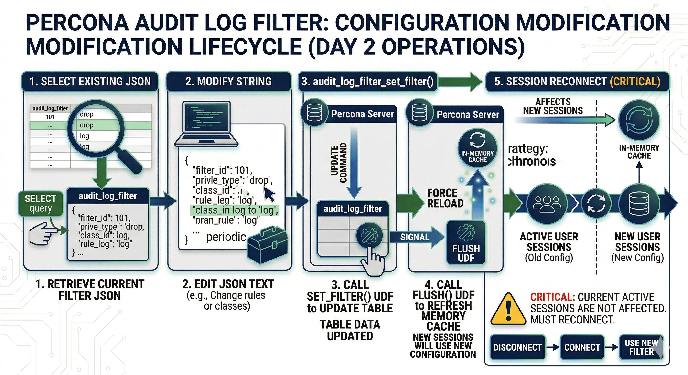

# Filter the Audit Log Filter logs

Rule-based filtering includes or excludes events by these attributes:

* User account

* Audit event class

* Audit event subclass

* Audit event fields, for example `COMMAND_CLASS` or `STATUS`

[`audit_log_filter.event_mode`](audit-log-filter-variables.md#audit_log_filterevent_mode) controls which classes and subclasses you can target. Validated names appear in [Audit Log Filter definition fields](audit-log-filter-definition-fields.md).

Define multiple filters and assign any filter to multiple accounts. You can also register a default filter for accounts without a specific row. Define filters through SQL function calls.

After you define a filter, the server persists the filter in `mysql` system tables.

## Audit log filter functions

The six management UDFs in the following table — `audit_log_filter_flush()`, `audit_log_filter_set_filter()`, `audit_log_filter_remove_filter()`, `audit_log_filter_set_user()`, `audit_log_filter_remove_user()`, and [`audit_log_rotate()`](audit-log-filter-variables.md#audit_log_rotate) — require the `AUDIT_ADMIN` privilege.

The reader UDFs ([`audit_log_read()`](audit-log-filter-variables.md#audit_log_read), [`audit_log_read_bookmark()`](audit-log-filter-variables.md#audit_log_read_bookmark)), the session-id helper ([`audit_log_session_filter_id()`](audit-log-filter-variables.md#audit_log_session_filter_id)), and the keyring helpers ([`audit_log_encryption_password_get()`](audit-log-filter-variables.md#audit_log_encryption_password_getkeyring_id), [`audit_log_encryption_password_set()`](audit-log-filter-variables.md#audit_log_encryption_password_setnew_password)) do not require `AUDIT_ADMIN`. The keyring helpers require an initialized keyring component or plugin.

The following functions drive rule-based filtering:

| Function | Description | Example |
|---|---|---|
| `audit_log_filter_flush()` | Flush filter tables and reload definitions into the component. | `SELECT audit_log_filter_flush();` |
| `audit_log_filter_set_filter()` | Create or replace a named filter. | `SELECT audit_log_filter_set_filter('log_connections', '{ "filter": {} }');` |
| `audit_log_filter_remove_filter()` | Drop a named filter. | `SELECT audit_log_filter_remove_filter('filter-name');` |
| `audit_log_filter_set_user()` | Bind a filter to a user account. | `SELECT audit_log_filter_set_user('user-name@localhost', 'filter-name');` |
| `audit_log_filter_remove_user()` | Clear filter bindings for a user account. | `SELECT audit_log_filter_remove_user('user-name@localhost');` |

Use SQL to define, inspect, and change audit log filters. Definitions live in the `mysql` system database.

[`audit_log_session_filter_id()`](audit-log-filter-variables.md#audit_log_session_filter_id) returns the active audit log filter ID for the current session.

Filter definitions are JSON values.

See [`audit_log_filter_flush()`](audit-log-filter-variables.md#audit_log_filter_flush) and [Persistence and refreshing](audit-log-filter-variables.md#persistence-and-refreshing) in [Audit log filter functions, options, and variables](audit-log-filter-variables.md) for:

* Reloading rules from tables.

* Persistence after `audit_log_filter_set_filter()`.

* Post-flush session behavior.

## Filter modification lifecycle

The following diagram shows how filter changes persist, reload into the component, and reach sessions, including when [`audit_log_filter_flush()`](audit-log-filter-variables.md#audit_log_filter_flush) runs.



## Constraints

Enable the `component_audit_log_filter` component and ensure audit tables exist before calling audit log filter functions. The account must hold the required privileges.

## Filter definition validation

The server validates filter definitions at parse time and rejects invalid input with a clear error:

* Unknown field names (for example, `"WRONG.str"`)

* Invalid class or event subclass names

* Empty arrays (for example, `"class": []`)

* Unknown JSON keys

* `print` rules that reference invalid fields for any class in a multi-class array

* Mismatched field types (for example, negative values for unsigned fields, or integers where only strings are allowed)

An empty filter object `{}` is equivalent to `{"filter": {"log": true}}` and logs every event. To log nothing, use `{"filter": {"log": false}}`.

Parse-phase subclass names must use `preparse` and `postparse`.

[`audit_log_filter.event_mode`](audit-log-filter-variables.md#audit_log_filterevent_mode) controls which classes new definitions may use. Filters saved under `FULL` can still load under `REDUCED` with some classes skipped. See the variable reference for details.

## Using the audit log filter functions

### Assignment vs rules inside the JSON

Two mechanisms apply, in order:

1. **Assignment (`mysql.audit_log_user`).** Each session uses one named filter from the `USER` and `HOST` columns. The columns take the same `user_name`@`host_name` form you pass to [`audit_log_filter_set_user()`](audit-log-filter-variables.md#audit_log_filter_set_useruser_name-filter_name). The server loads the filter's JSON from `mysql.audit_log_filter`. Assignments do not merge. A session never evaluates two separate filter definitions at once.

2. **Rules inside the assigned JSON.** `log` conditions on a class or event block narrow which events match within the already-selected filter. Conditions compare event fields such as `user.str`, `host.str`, `table_database.str`, `table_name.str`, and `status` with `field` items. Combine conditions with `and`, `or`, and `not`. These conditions are not a second user-level or host-level assignment row. For example, bind one filter to `'app'@'%'` and include a `log` condition under a `connection` rule so that only connection events from chosen client hosts are logged.

See [Test event field values](write-filter-definitions.md#test-event-field-values) and [Combine conditions with logical operators](write-filter-definitions.md#combine-conditions-with-logical-operators) for the grammar used in rule-level conditions.

### Which `audit_log_user` row applies

On connect, the component selects a row in `mysql.audit_log_user` whose `USER` and `HOST` match the session account. Literal `user`@`host` pairs match when they equal the session identity. Wildcard characters `%` and `_` are allowed in the host portion of the assignment string. See [`audit_log_filter_set_user()`](audit-log-filter-variables.md#audit_log_filter_set_useruser_name-filter_name). Pattern matching follows the behavior set by that function.

Keep assignments non-overlapping when you use wildcards. When several rows could match one connection, precedence is not specified on this page. Prefer explicit literal `user`@`host` rows, or one clear pattern plus a `'%'` default. Confirm behavior on a test server.

When no row matches, the component uses the default assignment: the account registered with `audit_log_filter_set_user()` using `%` as the user name.

When neither a matching row nor a default exists, the component skips event processing for that connection.

A specific account row overrides the default. When both `admin`@`localhost` and `%` have filters, `admin` from `localhost` uses the `admin`@`localhost` filter, not the default.

You can bind filters to named accounts or remove those bindings.

To clear a binding, unassign the filter or assign a different one. Session refresh on assignment change is described under [`audit_log_filter_set_user()`](audit-log-filter-variables.md#audit_log_filter_set_useruser_name-filter_name) and [`audit_log_filter_remove_filter()`](audit-log-filter-variables.md#audit_log_filter_remove_filterfilter_name).

## set_filter options and available filters

The JSON layout — `filter`, `class`, nested rules, and examples — appears in [Write audit_log_filter definitions](write-filter-definitions.md). The authoritative list of class names, event subclass names, and per-class field names that `audit_log_filter_set_filter()` accepts appears in [Audit Log Filter definition fields](audit-log-filter-definition-fields.md). This section lists the keys that may appear at each level of a filter definition.

### Filter-level keys

| Key | Role |
|---|---|
| `log`   | Boolean global default. `true` enables logging everywhere not turned off by a more specific rule. `false` requires per-class or per-event `log` overrides to write anything. |
| `class` | One class block or an array of class blocks. Each block sets `"name"` to an event class: `general`, `connection`, `table_access`, or `message`. `event_mode=FULL` also accepts `global_variable`, `command`, `query`, `stored_program`, `authentication`, and `parse`. |
| `id`    | Optional filter identifier. Referenced by `activate` and `ref` when one filter swaps itself for another mid-session. See [Replace a filter dynamically](write-filter-definitions.md#replace-a-filter-dynamically). |

### Class-block keys

| Key | Role |
|---|---|
| `name`  | The class name from the preceding list. |
| `log`   | Optional. Boolean, or a condition that narrows matches by event-field values. |
| `event` | Optional. One event block or an array. Each block names one subclass and can carry `log`, `abort`, `print`, or a nested `filter`. Subclasses depend on the class. For `table_access`: `read`, `insert`, `update`, and `delete`. For `connection`: `connect`, `disconnect`, and `change_user`, plus `pre_authenticate` in `FULL` mode. See the [event and subclass table](write-filter-definitions.md#list-of-event-and-subclass-options) and [definition fields](audit-log-filter-definition-fields.md). |
| `print` | Optional. Field-replacement rule. Limited to replacing `general_query.str` or `query.str` with `query_digest`. See [Redact audit log fields](redact-audit-log-fields.md). |

### Event-block keys

| Key | Role |
|---|---|
| `name`   | Subclass name. A string for one subclass, or an array for several. |
| `log`    | Optional. Boolean, or a condition over event fields. |
| `abort`  | Optional. Boolean or condition that blocks execution of matching statements. See [Block statements with an audit log filter](block-statements-with-audit-filter.md). |
| `print`  | Optional. Field-replacement rule scoped to the event. See [Redact audit log fields](redact-audit-log-fields.md). |
| `filter` | Optional. Nested subfilter used with `activate` and `ref` for dynamic filter swapping. See [Replace a filter dynamically](write-filter-definitions.md#replace-a-filter-dynamically). |

### Conditions

`log` and `abort` accept a Boolean (`true` or `false`) or a condition built from the following items:

| Item | Role |
|---|---|
| `field`    | `{ "name": "<event-field>", "value": <value> }`. Compares an event field such as `user.str`, `host.str`, `table_database.str`, `table_name.str`, `status`, `general_command.str`, or `general_sql_command.str`. Per-class fields appear in [Audit Log Filter definition fields](audit-log-filter-definition-fields.md). |
| `variable` | `{ "name": "<server-variable>", "value": <value> }`. Compares a predefined variable such as `audit_log_connection_policy_value`. |
| `function` | `{ "name": "<function>", "args": [...] }`. Calls a built-in such as `find_in_include_list`, `string_find`, or `query_digest`. |
| `and`      | Array of sub-conditions. All must be true. |
| `or`       | Array of sub-conditions. At least one must be true. |
| `not`      | A single sub-condition. True when the inner condition evaluates to false. |

Field-value typing appears under [`audit_log_filter_set_filter()`](audit-log-filter-variables.md#audit_log_filter_set_filterfilter_name-definition) and in the [`connection`](audit-log-filter-definition-fields.md#connection) section of [Audit Log Filter definition fields](audit-log-filter-definition-fields.md). Examples include JSON numbers for integer fields such as `status`, strings for `*.str` fields, and `"::tcp/ip"`-style symbolic constants for `connection_type`.

### Examples

Start from a single-class filter that logs every `connection` event the component sees:

```sql
SELECT audit_log_filter_set_filter('log_connection', '{
  "filter": {
    "class": { "name": "connection" }
  }
}');
```

Narrow to a single subclass by nesting `event` inside the class block (not as a sibling of `class`):

```sql
SELECT audit_log_filter_set_filter('log_connect_only', '{
  "filter": {
    "class": {
      "name": "connection",
      "event": { "name": "connect" }
    }
  }
}');
```

Narrow further by adding a `log` condition that tests event fields. The following example logs `connect` events from only two accounts, originating from one host:

```sql
SELECT audit_log_filter_set_filter('log_admin_connect', '{
  "filter": {
    "class": {
      "name": "connection",
      "event": {
        "name": "connect",
        "log": {
          "and": [
            { "field": { "name": "user.str", "value": ["admin", "developer"] } },
            { "field": { "name": "host.str", "value": "10.0.0.5" } }
          ]
        }
      }
    }
  }
}');
```

For full authoring detail, see:

* [Write audit_log_filter definitions](write-filter-definitions.md) — inclusive and exclusive patterns, conditions, and the complete grammar.

* [Audit Log Filter definition fields](audit-log-filter-definition-fields.md) — canonical class, event, and field names that validation accepts.

* [`audit_log_filter.event_mode`](audit-log-filter-variables.md#audit_log_filterevent_mode) — `REDUCED` against `FULL` class sets.

## Additional reading

* [Write audit_log_filter definitions](write-filter-definitions.md)

* [Audit Log Filter definition fields](audit-log-filter-definition-fields.md)

* [Audit log filter functions, options, and variables](audit-log-filter-variables.md)

* [Audit Log Filter overview](audit-log-filter-overview.md)

* [Audit Log Filter quickstart](audit-log-filter-quickstart.md)

* [Audit Log Filter restrictions](audit-log-filter-restrictions.md)
