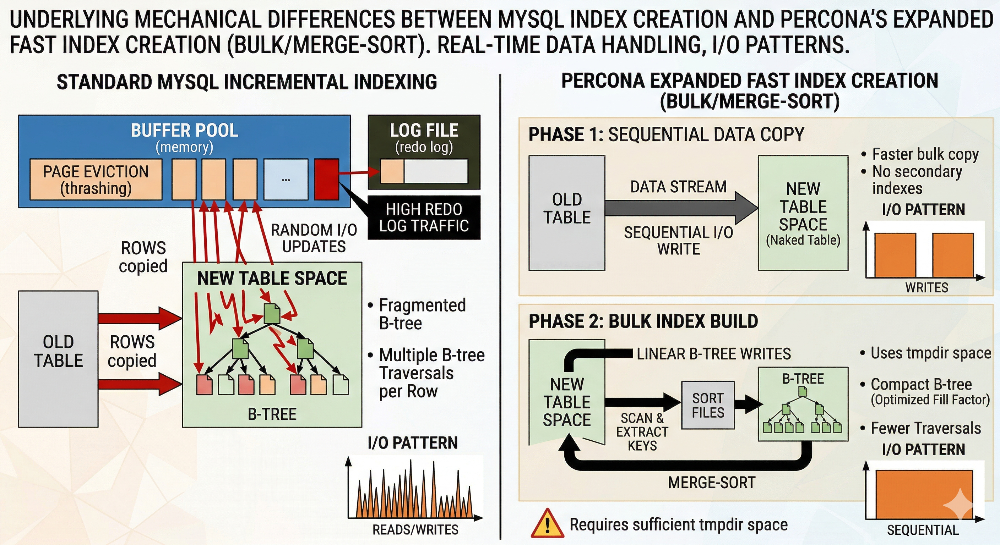
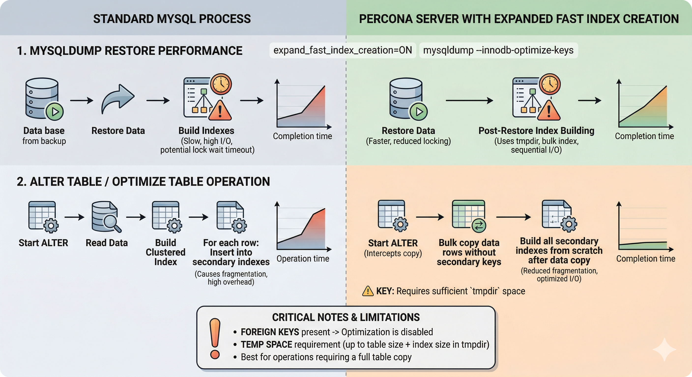

# Expanded fast index creation

## What fast index creation is

In InnoDB, secondary indexes are separate B-tree structures from the clustered index (the primary key). When the server creates a new secondary index on an existing table, the server can use two conceptually different approaches:

A. Row-by-row maintenance — For each row, insert its entries into the new secondary index as you go. These inserts arrive in primary-key order, not secondary-key order, causing many random page splits and high write amplification. If the server is copying the table (via a rebuild ALTER TABLE), the same pattern applies: every copied row must update every secondary index immediately.

B. Fast index creation (sorted / bulk build) — The server scans the table’s clustered index in primary-key order, generates secondary-key tuples, sorts them (often using external merge sort), and builds the secondary index from that ordered stream. Work is staged in temporary files under the configured tmpdir and then merged into a compact B-tree. This method avoids the worst random-insert behavior of the row-by-row approach and usually completes with less I/O and a less fragmented index.

So, fast index creation means building the secondary index from a sorted stream after reading the table (or a copy) in clustered index order, instead of growing the index with arbitrary-order inserts during the same phase as the data copy.

### Why deferring secondary indexes can beat keeping them during a copy

On a table-copy ALTER TABLE, the expensive part is not dropping a secondary index definition. The benefit comes from what happens during row copying. If every secondary index stays live, each inserted row triggers incremental B-tree maintenance in several trees at once, ordered by the primary-key scan. This causes scattered leaf-page writes (random-like I/O) and many page splits. If eligible secondaries are absent during the copy and built afterward, the copy loop mainly touches the clustered index, which is a comparatively sequential read of the old table and write of the new clustered index. Each secondary is then produced by one scan-plus-merge-sort pipeline into tmpdir, then merged into a fresh B-tree. The architectural shift is incremental: interleaved updates rather than deferred bulk builds from sorted runs, not just a superficial reordering of DDL syntax.

Dropping an index is often a cheap metadata change. The performance gain mainly comes from creating indexes on large tables.

## Technical comparison: physical handling during a table copy

The following applies only when InnoDB performs a full table rebuild (the copy algorithm), such as when ALTER TABLE operations materialize a new table and copy rows from the old one, for example, due to changes in column order or data type. InnoDB stores the clustered index (primary key / row body) and each secondary index as separate on-disk B-trees. The architectural question is when those B-trees are updated relative to the row copy.

The diagram contrasts standard MySQL incremental indexing during a table copy with Percona's expanded fast index creation. This involves a sequential copy into a table without eligible secondary indexes, followed by bulk merge-sort index builds using tmpdir.



### Oracle MySQL Community Edition: incremental secondary indexes during the copy

On the copy path, Oracle MySQL Community Edition (Oracle MySQL {{vers}}) materializes a new InnoDB table to receive rows. This internal rebuild depends on the statement, but the engine copies from the old clustered index into a new on-disk structure. The new table is created with all secondary index definitions already in place. For each row read from the old table, the server inserts it into the new clustered index and immediately applies all secondary index changes required for that row, performing incremental maintenance of every live secondary B-tree.

Physically, those per-row secondary index updates behave like many small, interleaved B-tree inserts. Secondary-key values do not appear in secondary-key order but follow primary-key scan order, so the engine touches many different leaf pages over time. In practice, this produces:

* Heavy random (or scattered) I/O across secondary index B-trees, because each row can require updates to several trees at unrelated leaf positions.

* Higher fragmentation in the new secondary indexes: repeated inserts in non-ideal key order cause page splits, partially filled pages, and more structural churn than a single bulk build.

The clustered index still grows in primary-key order during the scan, but the secondary structures are “grown” incrementally alongside every row.

### Percona Server: two-phase copy (bulk / merge-sort secondary builds)

When `expand_fast_index_creation` is enabled and the optimization applies, Percona Server replaces the single interleaved loop with two phases on the same copy-style DDL path.

#### Phase 1: sequential clustered data copy (no eligible secondaries)

Eligible non-unique secondary indexes are not present or maintained while rows are copied into the new table. The engine performs a sequential, primary-key-ordered read of the old clustered index and writes the new clustered index without maintaining deferred secondaries row by row. In storage terms, the hot path is dominated by moving the clustered row payload in key order rather than fanning every row out into several B-trees at once.

#### Phase 2: bulk secondary index build (merge-sort via `tmpdir`)

After the last row is in place, the server builds each deferred secondary index in its own pass. It scans the new clustered index in primary-key order, emits secondary-key tuples, sorts them (typically external merge sort with runs staged under[`tmpdir`](https://dev.mysql.com/doc/refman/{{vers}}/en/server-system-variables.html#sysvar_tmpdir)),
merges into a single ordered stream, and allocates and fills a new secondary B-tree from that stream. This is the same family of mechanics as InnoDB's “fast index creation” (sorted bulk build), but applied after the clustered table body exists instead of interleaving random-order secondary inserts with every row of the copy.

Effects at the storage layer:

* The copy loop avoids the worst random-like secondary-index churn of the Community approach; heavy secondary work is concentrated in predictable scan/sort/merge passes.

* Secondary indexes are typically more compact and incur less incremental fragmentation from the copy phase than indexes grown row-by-row during the copy, because pages are filled from sorted runs. The trees are not guaranteed “perfect” or free of all splits forever—normal DML afterward still mutates them—but the initial build avoids the split storm tied to interleaved inserts.

The tradeoff is large temporary space under `tmpdir` for sort/merge files, as described in [`tmpdir`, disk space, and recovery](innodb-expanded-fast-index-creation.md#tmpdir-disk-space-and-recovery).

### Technical comparison summary

| Technical aspect | Oracle MySQL (Community) | Percona Server (expanded, optimization applies) |
| --- | --- | --- |
| Index update strategy | Incremental: each copied row updates every live secondary index | Bulk (post-copy): eligible non-unique secondaries built after clustered data is complete |
| I/O pattern during copy | Random-like / scattered writes across many secondary B-tree leaves | Sequential clustered scan for the row copy; secondary work shifted to separate scan/sort/merge passes |
| Merge-sort use (`tmpdir`) | Little or none for maintaining secondaries during the interleaved copy; secondaries grow by per-row insertion | Extensive: external merge sort and merge passes for each deferred secondary index build |
| Index quality after DDL | Often more fragmented from row-by-row growth and splits during copy | Typically more compact; avoids the incremental split behavior tied to the copy loop |
| `mysqldump` restore shape | Secondary definitions in `CREATE TABLE`; indexes maintained during data load | With `--innodb-optimize-keys`, keys omitted from `CREATE TABLE` and added via trailing `ALTER TABLE` after load ([mysqldump --innodb-optimize-keys and dump file structure](innodb-expanded-fast-index-creation.md#mysqldump-innodb-optimize-keys-and-dump-file-structure)) |
| Temporary disk (`tmpdir`) | Lower demand from the incremental copy pattern alone | High: sort runs and merges for each rebuilt secondary index |

### mysqldump --innodb-optimize-keys and dump file structure

Standard Oracle `mysqldump` emits `CREATE TABLE` for an *InnoDB* table with all `KEY`, `UNIQUE KEY`, and relevant `CONSTRAINT` clauses inline. During restore, the server must maintain those secondary structures while rows stream
in using the same incremental pattern as a copy-style DDL workload.

Percona’s `mysqldump --innodb-optimize-keys` rewrites the logical SQL in the dump file. For *InnoDB* tables, the tool omits secondary key and related clauses from `CREATE TABLE` and emits one or more trailing `ALTER TABLE` statements that add those keys after most data has loaded.
This forces a data-first, indexes-later restore so the server can build secondaries using the sorted bulk path. It also allows Percona Server to apply expanded fast index creation on those post-load alters when the variable is on. Details and restrictions remain in [the mysqldump command](innodb-expanded-fast-index-creation.md#the-mysqldump-command).

### I/O pattern overview

During the copy loop:

* Oracle MySQL Community: read one row → insert into clustered index → update every secondary B-tree for that row → repeat until done.

* Percona Server (expanded): read one row → insert into clustered index only (eligible secondaries not maintained in that loop) → repeat until done. Then, for each deferred secondary index, scan the clustered index, sort, merge from
  `tmpdir`, attach the new B-tree.

## How expanded fast index creation differs from Oracle MySQL

This section includes a comparison graphic that summarizes end-to-end behavior
(including restore). For the on-disk and I/O model in depth, see
[Technical comparison: physical handling during a table copy](innodb-expanded-fast-index-creation.md#technical-comparison-physical-handling-during-a-table-copy).



The following compares Percona Server for MySQL with Oracle MySQL {{vers}} on code paths that rebuild the table. InnoDB classifies each `ALTER TABLE` operation by algorithm (`INSTANT`, `INPLACE`, `COPY`, and so on). These classifications can change between releases, so treat the [InnoDB online DDL
documentation :octicons-link-external-16:](https://dev.mysql.com/doc/refman/{{vers}}/en/innodb-online-ddl.html) as authoritative for whether a specific statement performs a copy in your version.

Upstream *MySQL* (*InnoDB*) already uses a sorted, bulk-style path when MySQL adds a secondary index in operations that are implemented as “add index only” (for example, some `CREATE INDEX` / `ALTER TABLE ... ADD INDEX` flows that do not rebuild the whole table).

Where Oracle MySQL still does a full table rebuild (copy algorithm, for example, some `ALTER TABLE` changes that force a new table), rows are inserted into the new copy while all secondary indexes remain live. Each insert must update every non-primary index in a single operation. Even if the server later uses efficient index-building mechanisms, interleaving those updates with the copy keeps more indexes “hot” throughout the copy and tends to produce heavier random I/O and more fragmented trees than deferring secondary index creation until the clustered data is complete.

Percona Server for MySQL extends that behavior with expanded fast index creation (controlled by
[`expand_fast_index_creation`](innodb-expanded-fast-index-creation.md#expand-fast-index-creation)). On rebuild-style
`ALTER TABLE` or `OPTIMIZE TABLE`, eligible non-unique secondary indexes are dropped for the copy phase and recreated afterward using the fast sorted-build
path on the finished table. The copy phase then maintains only what *InnoDB* requires for the clustered index and any indexes that cannot be deferred. This behavior is the main difference between Oracle MySQL on the same code paths.

Oracle MySQL {{vers}} can apply `INSTANT` or in-place (`INPLACE`) DDL to many `ALTER TABLE` operations, so the server avoids a full table copy or keeps work inside the existing *InnoDB* file. That path is separate from the
rebuild logic `expand_fast_index_creation` augmentations; there is no interaction to “tune” for those statements.

## When the expanded fast index creation optimization applies

### `INSTANT`, `INPLACE`, and why the `expand_fast_index_creation` variable usually does not matter for those algorithms

If an `ALTER TABLE` runs as `INSTANT` (for example, adding a nullable column at
the end of the table when supported) or as an online in-place operation that
does not rebuild the whole table, the server is not performing a full table
copy that Percona optimizes. In those cases
`expand_fast_index_creation` is generally unnecessary: the expensive secondary
index pattern that expanded fast index creation improves simply is not used in the same way.

### When `expand_fast_index_creation` helps

`expand_fast_index_creation` is most beneficial when the operation requires a
table copy—for example changing a column’s data type in a way that forces a
rebuild, or other alters classified with the copy algorithm. On that path,
Percona Server intercepts the copy so eligible non-unique secondary indexes are
rebuilt with the sorted temporary-file workflow instead of being maintained on
every inserted row during the copy.

Expanded fast index creation only affects statements that rebuild the table and
copy rows into a new *InnoDB* table. Typical cases include:

* `OPTIMIZE TABLE` on an *InnoDB* table (internally `ALTER TABLE ... ENGINE=InnoDB`)

* `ALTER TABLE` operations that the server implements with a table rebuild and
  the copy algorithm, as listed in the [InnoDB online DDL operations
  table :octicons-link-external-16:](https://dev.mysql.com/doc/refman/{{vers}}/en/innodb-online-ddl-operations.html)

* An `ALTER TABLE` where you explicitly request `ALGORITHM=COPY` (when that
  algorithm is permitted for the operation)

Routine schema changes that stay on `INSTANT` or `INPLACE` never enter the
table-copy rebuild path and are unaffected by `expand_fast_index_creation`.

## Verify and monitor

* Check whether expanded fast index creation is enabled:

    ```sql
    SHOW VARIABLES LIKE 'expand_fast_index_creation';
    ```

    In Percona Server for MySQL {{vers}} the default is `OFF`. Enable
    `expand_fast_index_creation` for a
    session or globally before running DDL, for example
    `SET SESSION expand_fast_index_creation = ON;`.


* To see how *MySQL* classifies a specific `ALTER TABLE`, use the online DDL
  documentation for your version. For which statements perform a table copy
  (where expanded fast index creation matters), see
  [When the expanded fast index creation optimization applies](innodb-expanded-fast-index-creation.md#when-the-expanded-fast-index-creation-optimization-applies).
  There is no single `EXPLAIN` for DDL; classification is per operation and
  version.


* [`tmpdir`](https://dev.mysql.com/doc/refman/{{vers}}/en/server-system-variables.html#sysvar_tmpdir)
  free space is the usual operational bottleneck; see
  [`tmpdir`, disk space, and recovery](innodb-expanded-fast-index-creation.md#tmpdir-disk-space-and-recovery) for how large `tmpdir` must be and what happens when
  `tmpdir` space is exhausted.

Besides shortening DDL directly,
[`expand_fast_index_creation`](innodb-expanded-fast-index-creation.md#expand-fast-index-creation) may also help
subsequent DML because indexes built in one sorted pass are often less
fragmented than those maintained incrementally through a long copy.

## The mysqldump command

For how the dump file is structured (omitted `KEY` clauses and trailing
`ALTER TABLE`), see
[mysqldump --innodb-optimize-keys and dump file structure](innodb-expanded-fast-index-creation.md#mysqldump-innodb-optimize-keys-and-dump-file-structure)
under [Technical comparison](innodb-expanded-fast-index-creation.md#technical-comparison-physical-handling-during-a-table-copy).

The `--innodb-optimize-keys` option changes the way *InnoDB* tables are dumped,
so that secondary and foreign keys
are created after loading the data, thus taking advantage of fast index
creation. More specifically:

* `KEY`, `UNIQUE KEY`, and `CONSTRAINT` clauses are omitted from `CREATE
TABLE` statements corresponding to *InnoDB* tables.

* An additional `ALTER TABLE` is issued after dumping the data, in order to
create the previously omitted keys.

## `ALTER TABLE`

When `ALTER TABLE` requires a table copy, secondary keys are dropped and
recreated later, after copying the data. The following restrictions apply:

* Only non-unique keys can be involved in the expanded fast index creation optimization.

* If the table contains foreign keys, or a foreign key is being added as a part
of the current `ALTER TABLE` statement, the expanded fast index creation optimization is disabled for all
keys.

* If the table is partitioned, the expanded fast index creation optimization is disabled for all keys.

## `OPTIMIZE TABLE`

Internally, `OPTIMIZE TABLE` is mapped to `ALTER TABLE ... ENGINE=innodb`
for *InnoDB* tables. As a consequence, `OPTIMIZE TABLE` also benefits from fast index
creation when `expand_fast_index_creation` is enabled and the expanded fast index creation optimization
applies, with the same restrictions as for `ALTER TABLE`.

## `tmpdir`, disk space, and recovery

In practice, expanded fast index creation usually fails because the filesystem used for tmpdir (often the same mount as /tmp) runs out of disk space.

With expanded fast index creation enabled, the server reduces index maintenance memory costs but also materializes each secondary index in temporary files (sorted runs and merge passes). It then merges the result into the final InnoDB index. This can consume much more transient space than a rough “indexes fit in the tablespace” estimate suggests.

When planning free space for tmpdir, use the secondary indexes being rebuilt as the starting point, not just the table’s row data size. The merge-sort build writes temporary sorted runs to tmpdir before the final B-tree exists on disk. Peak usage is usually much higher than the finished indexes alone. Reserve more free tmpdir space than those indexes will occupy when done, and add an extra margin because the same ALTER TABLE or OPTIMIZE TABLE can use additional temporary files for the table copy.

Example: aExample: a table with about 500 GB of data and 200 GB of secondary indexes can need well over 200 GB of free tmpdir space while those indexes are being built, not just 200 GB as a safe cap.isk that holds tmpdir runs out of free space while the ALTER TABLE, OPTIMIZE TABLE, or related index-build step is still running, the statement fails and rolls back. You lose the work completed up to that point.

Before you run the same statement again, fix the space problem. Typical options:

* Make more free space on the filesystem tmpdir uses by removing unrelated files, rotating logs, or growing the underlying disk or volume. This allows the merge-sort runs and any copy-side temporary files to complete. This operation keeps the configuration unchanged.

* Redirect tmpdir to a directory on a different mount point with sufficient free space, such as a dedicated fast disk for database temp work. Set the tmpdir server variable according to the MySQL Reference Manual for your version, including scope, restart requirements, and secure path permissions. Until tmpdir points to adequate space, the same DDL is likely to fail again at the same stage.

* Disable expanded fast index creation for the retry, for example, SET SESSION expand_fast_index_creation = OFF before ALTER TABLE, OPTIMIZE TABLE, or the post-load ALTER TABLE from a restore. The server then falls back to the stock interleaved pattern on copy-style DDL (see Technical comparison: physical handling during a table copy). This path usually needs less peak tmpdir space for the sorted secondary-index build because the bulk merge-sort path is not used. However, the operation can take longer and leave more fragmented secondary indexes. It does not remove all temporary space needs: a full table copy can still create large temporary files elsewhere.

## Limitations

The following lists cases when the expanded fast index creation optimization is not applicable, or when the variable cannot change behavior (aside from [`tmpdir` sizing and failures](innodb-expanded-fast-index-creation.md#tmpdir-disk-space-and-recovery)).

* `ALTER TABLE` that runs as `INSTANT` or `INPLACE` without a full table rebuild never enters the table-copy path that expanded fast index creation changes, so the variable setting has no effect. That is a matter of scope (the feature is inert on those paths), not the same kind of restriction as the following bullets. For the full explanation, see
  [When the expanded fast index creation optimization applies](innodb-expanded-fast-index-creation.md#when-the-expanded-fast-index-creation-optimization-applies) (opening subsection on `INSTANT` and `INPLACE`).


* `UNIQUE` indexes in `ALTER TABLE` are ignored to enforce uniqueness where
necessary when copying the data to a temporary table;


* `ALTER TABLE` and `OPTIMIZE TABLE` always process tables containing
foreign keys as if [expand_fast_index_creation](innodb-expanded-fast-index-creation.md#expand-fast-index-creation) is OFF to avoid
dropping keys that are part of a FOREIGN KEY constraint;


* `ALTER TABLE` and `OPTIMIZE TABLE` always process partitioned tables as if
[expand_fast_index_creation](innodb-expanded-fast-index-creation.md#expand-fast-index-creation) is OFF;


* mysqldump --innodb-optimize-keys ignores foreign keys because
*InnoDB* requires a full table rebuild on foreign key changes. So adding foreign keys
back with a separate `ALTER TABLE` after restoring the data from a dump
would actually make the restore slower;


* mysqldump --innodb-optimize-keys ignores indexes on
`AUTO_INCREMENT` columns, because those columns must be indexed, so temporarily dropping the corresponding index is impossible;


* mysqldump --innodb-optimize-keys ignores the first UNIQUE index on
non-nullable columns when the table has no `PRIMARY KEY` defined, because in
that layout *InnoDB* picks such an index as the clustered one.

## System variables

### `expand_fast_index_creation`

| Option         | Description        |
| -------------- | ------------------ |
| Command Line:  | Yes                |
| Config file    | No                 |
| Scope:         | Local/Global       |
| Dynamic:       | Yes                |
| Data type      | Boolean            |
| Default value  | OFF                |

When set to `ON`, *InnoDB* may drop eligible non-unique secondary indexes for the
data-copy phase of rebuild-style `ALTER TABLE` and `OPTIMIZE TABLE`, then
recreate those indexes with the sorted bulk build described in
[What fast index creation is](innodb-expanded-fast-index-creation.md#what-fast-index-creation-is).

## Related documentation

### Percona Server for MySQL documentation

* [Percona Server for MySQL feature comparison](feature-comparison.md) — how expanded fast index creation compares to MySQL {{vers}}

* [Percona Server for MySQL variables](percona-server-system-variables.md) — full list of Percona-specific system variables, including `expand_fast_index_creation`

* [Extended mysqldump](extended-mysqldump.md) — Percona `mysqldump` enhancements, including `--innodb-optimize-keys`

* [InnoDB page fragmentation counters](innodb-fragmentation-count.md) — monitoring index fragmentation

### MySQL Reference Manual

* [InnoDB and online DDL :octicons-link-external-16:](https://dev.mysql.com/doc/refman/{{vers}}/en/innodb-online-ddl.html)

* [InnoDB online DDL operations :octicons-link-external-16:](https://dev.mysql.com/doc/refman/{{vers}}/en/innodb-online-ddl-operations.html)

* [`tmpdir` system variable :octicons-link-external-16:](https://dev.mysql.com/doc/refman/{{vers}}/en/server-system-variables.html#sysvar_tmpdir)
