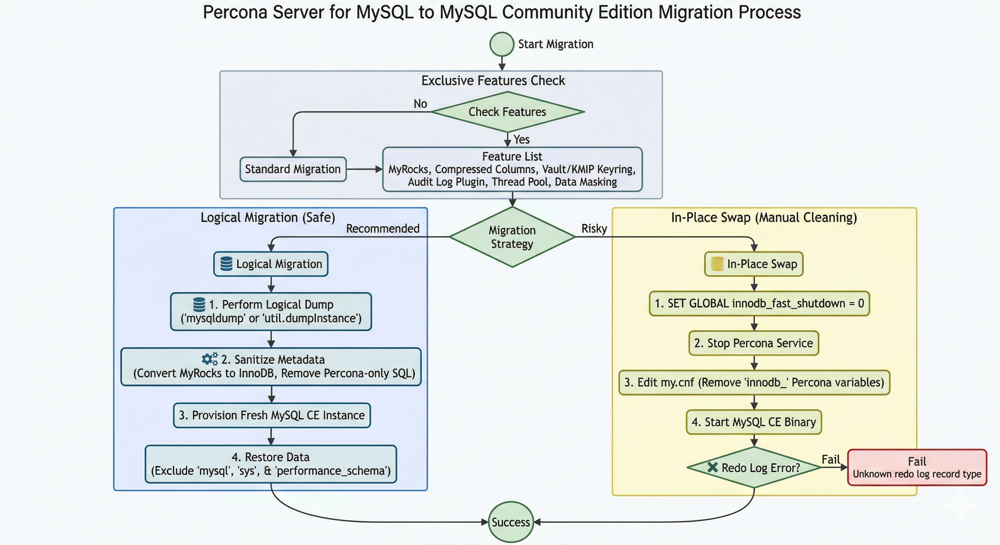

# Migrate from Percona Server for MySQL to MySQL Community Edition

**Topic type**: Task

Using Percona-only features on Percona Server is supported and often beneficial. If you later move to MySQL Community Edition (CE), migration is straightforward when you follow the [best practices](#best-practices-migrating-to-mysql-ce). 

!!! warning "Data loss risk"

    Some Percona Server features are one-way doors. MyRocks tables, compressed columns, and Percona keyring components leave on-disk metadata that MySQL Community Edition cannot read. Verify the migration path with a logical dump and restore. Do not perform an in-place binary swap if any of these features are active.

Both products share the same core code; Percona Server adds performance and security features that do not exist in MySQL CE. Certain features create a ["one-way door"](#summary-of-the-one-way-door-risk): metadata and structural changes they introduce cannot be interpreted by MySQL CE. The features include MyRocks, compressed columns and compression dictionaries, Percona keyring components (Vault, KMIP, AWS KMS), and, with more reversible impact, the Percona Audit Log plugin, PAM/LDAP authentication, Data Masking, and the thread pool.

The diagram below summarizes migration paths: checking for Percona-exclusive features, choosing a logical dump and restore (recommended) versus an in-place binary swap with cleanup, and the main steps in each path.

{ style="max-width: 100%; height: auto; width: 960px;" }

## Exclusive Features

When planning a migration to MySQL CE, you need to know which features are exclusive to Percona. These CE-incompatible features are not active by default: MyRocks, the Percona Audit Log plugin, the Audit Log Filter component, Data Masking, and PAM/LDAP authentication must be explicitly installed (or configured); only the thread pool is built in but off until you set `thread_handling=pool-of-threads` in the configuration. The following table summarizes the main exclusive features.

| Feature | Notes |
|---------|-------|
| [MyRocks Storage Engine](myrocks-index.md) | Not in MySQL CE; requires explicit installation. Migration: see [Performance and Engine](#performance-and-engine-features). |
| [Percona Audit Log Plugin](audit-log-plugin.md) | Not in MySQL CE. Migration: see [Security and Auditing](#security-and-auditing). |
| [Audit Log Filter](audit-log-filter-overview.md) | Not in MySQL CE. Migration: see [Security and Auditing](#security-and-auditing). |
| [PAM](pam-plugin.md) / [LDAP](ldap-authentication.md) Authentication | Not in MySQL CE; require manual configuration. Migration: see [Security and Auditing](#security-and-auditing). |
| [Data Masking](data-masking-overview.md) | Not in MySQL CE; must be manually installed. Migration: see [Security and Auditing](#security-and-auditing). |
| [Thread Pool](threadpool.md) | Built in but off until `thread_handling=pool-of-threads`. Migration: see [Performance and Engine](#performance-and-engine-features). |

## Performance and Engine Features

Percona Server includes several optimizations that MySQL Community cannot parse or execute. The following table describes migration actions for engine-related exclusive features (see [Exclusive Features](#exclusive-features) for the full list).

| Feature | Migration action |
|---------|------------------|
| XtraDB Enhancements | Remove Percona-only `innodb_` variables from your `my.cnf` (for example, `innodb_empty_free_list_algorithm`, `innodb_track_changed_pages`, `innodb_corrupt_table_action`, `innodb_cleaner_lsn_age_factor`). Basic InnoDB data is compatible. |
| [Thread Pool](threadpool.md) | Disable the thread pool and use the default one-thread-per-connection model. |
| [MyRocks Storage Engine](myrocks-index.md) | Migrate tables to InnoDB before dump (or edit dump to change `ENGINE=MyRocks` to `ENGINE=InnoDB`). |
| [Compressed columns and compression dictionaries](compressed-columns.md) | Decompress or alter columns before dump; no CE equivalent. See the linked doc. If tables use this feature, migration to CE is not possible until columns are changed. |

To see which `innodb_` variables are exclusive to Percona, use the [Percona Server system variables reference](percona-server-system-variables.md). That page lists all Percona-specific system variables (including `innodb_*`). Remove from your `my.cnf` any variable that does not exist in your target MySQL Community Edition release.

Compressed columns and compression dictionaries are a major compatibility issue. If you have tables that use this feature, you cannot migrate to MySQL CE; you must remove or alter those columns (for example, decompress the columns) before a logical dump and restore. In addition, this feature creates additional tables in the system tablespace. To see whether any compression dictionaries (and thus those system tables) exist, query the `INFORMATION_SCHEMA` views that the feature adds: `COMPRESSION_DICTIONARY` and `COMPRESSION_DICTIONARY_TABLES`. See [Compressed columns with dictionaries](compressed-columns.md) for the structure of those views. Those system tables may cause problems when moving to MySQL CE even if you do not use compressed columns in your own tables.

## Security and Auditing

Migration actions for security and auditing features that are exclusive to Percona (see [Exclusive Features](#exclusive-features) for the full list).

| Feature | Migration action |
|---------|------------------|
| [Audit Log Plugin](audit-log-plugin.md) | Disable auditing or use a community-supported alternative. |
| [Audit Log Filter](audit-log-filter-overview.md) | Uninstall the component and remove its configuration. |
| [PAM](pam-plugin.md) / [LDAP](ldap-authentication.md) Authentication | Migrate users to `caching_sha2_password` before switching. MySQL 9.x removes the server-side `mysql_native_password` plugin; MySQL 8.4 disables it by default. |
| [Data Masking](data-masking-overview.md) | Uninstall the Data Masking components. |

## Operational and Monitoring Features

| Feature | Notes |
|---------|-------|
| Extended Slow Query Log | Percona's slow query log includes extra fields (such as `Rows_examined` and `Thread_id`). MySQL Community will fail to start if MySQL Community encounters Percona-only log configuration variables in your config file. |
| Utility Components | Uninstall features such as the UUID_VX component or keyring plugins that are exclusive to Percona. |

To see which slow-query and log variables are Percona-only, use the [Percona Server system variables reference](percona-server-system-variables.md). Remove from your `my.cnf` any of these if present: `log_slow_filter`, `log_slow_rate_limit`, `log_slow_rate_type`, `log_slow_sp_statements`, `log_slow_verbosity`, `slow_query_log_always_write_time`, and `slow_query_log_use_global_control`.

Keyring components and variables that are exclusive to Percona must be removed or replaced before migration. MySQL Community Edition does not support the following; uninstall them and remove their configuration:

* Components: `component_keyring_vault` (HashiCorp Vault), `component_keyring_kmip` (KMIP), and `component_keyring_kms` (AWS KMS). See the [Keyring components overview](keyring-components-plugins-overview.md) for details.

* System variables: `keyring_vault_config` and `keyring_vault_timeout`. Remove these from your `my.cnf`. The [Percona Server system variables reference](percona-server-system-variables.md) lists all Percona-only variables.

MySQL CE supports the file-based keyring component `component_keyring_file`. If you need encryption after migration, plan to use this component or another keyring option documented for MySQL Community Edition.

If you are using these Percona keyring components (Vault, KMIP, or AWS KMS), migrate the keys to `component_keyring_file` with the [`mysql_migrate_keyring` utility](https://dev.mysql.com/doc/refman/8.4/en/mysql-migrate-keyring.html) before switching to MySQL CE. You can then perform an in-place migration if you have removed all other Percona-only features and confirmed that MySQL CE can read the on-disk data. Alternatively, use a logical dump and restore: export the data from Percona Server while the original keyring is active (the server decrypts the data when reading it), then restore the dump into a fresh MySQL CE instance.

If you used Percona's enhanced encryption features, specialized page compression, or `fast_checksum` (which alters how data is written to disk), MySQL Community Edition may not be able to read those pages. In that case you are not migrating data; you are leaving the data in a form that the Community binary cannot open. Before migration you must: (1) Do not copy data files or do an in-place binary swap. (2) Run mysqldump (or another logical dump tool) from Percona Server while the relevant features are still enabled so the server can read the data. (3) Restore the dump into a fresh MySQL CE instance. (4) In the configuration for the new CE instance, remove or omit the Percona-only on-disk format options (for example, `fast_checksum`) so the CE instance does not use them.

## Best practices: migrating to MySQL CE

When you have used Percona-exclusive features and decide to move to MySQL CE, the path is generally not a simple in-place package swap. Follow the steps below for a reliable migration.

### Requirement for Logical Migration

Because of potential binary incompatibilities and Percona-specific metadata (especially if MyRocks or specific keyring components are used), the only reliable method to migrate to MySQL CE is a logical dump and restore.

* Provision a fresh instance: Set up a completely new MySQL CE instance.

* Dump data: Use a tool such as mysqldump to export the data from Percona Server.

* Restore: Import the logical file into the fresh MySQL CE instance.

### Metadata and Sanitization Steps

A simple dump and restore often fails if Percona-specific features have left traces in the metadata. Specific sanitization is required:

* Storage Engine Conversion: Convert any tables using MyRocks to InnoDB before the dump, or edit the SQL script manually to change `ENGINE=MyRocks` to `ENGINE=InnoDB`.

* Compressed columns and compression dictionaries: If any tables use Percona's compressed columns or compression dictionaries, you cannot migrate to MySQL CE until you remove or alter those columns (for example, change `COLUMN_FORMAT COMPRESSED` to `COLUMN_FORMAT DEFAULT` or another supported format). MySQL CE does not support this feature.

* Authentication Cleanup: Drop or modify any users created with Percona-exclusive plugins (such as authentication_pam or authentication_ldap) so that they use a CE-supported plugin (such as caching_sha2_password) before migration.

* Configuration Sanitization: Remove all Percona-only variables from `my.cnf` (for example, `audit_log_*`, `thread_pool_*`, or extended slow_query_log variables). If the configuration file contains even one Percona-specific variable, MySQL CE will not start: the server rejects unknown system variables and exits at startup.

* On-disk format (enhanced encryption, specialized page compression, or `fast_checksum`): If you used options that change how InnoDB writes data to disk (for example, Percona encryption, page compression, or `fast_checksum`), MySQL CE may not recognize those page formats. Before migration: do not copy data files or switch binaries in place. Run a logical dump (for example, mysqldump) from Percona Server while the server is running and the feature is enabled, then restore the dump into a fresh MySQL CE instance. In the configuration for the new CE instance, omit or remove the Percona-only on-disk format options.

* System Table Cleanup: Percona sometimes adds columns to system tables for internal tracking. A logical dump of user databases is usually fine, but dumping and restoring the mysql system database can cause severe schema mismatches.

* System schemas (performance_schema, sys): Percona Server for MySQL {{vers}} adds telemetry and diagnostic tables to the `performance_schema` and `sys` schemas that MySQL CE does not recognize. A migration that reuses or restores those schemas leaves orphaned metadata in place. That metadata is not merely extra data; the orphaned objects can collide with new tables or columns when you apply future MySQL CE minor-version upgrades. Prefer a logical dump and restore of user data only, and let the MySQL CE instance create its own `performance_schema` and `sys` schemas at startup. See [Telemetry on Percona Server for MySQL](telemetry.md) and [Additional PERFORMANCE_SCHEMA tables](additional-performance-schema-tables.md) for context.

### If you switch binaries in place: clean shutdown and redo log

The role of the LSN (log sequence number): The LSN is a 64-bit integer that acts as a unique identifier for every change made to the database. The LSN is central to how the InnoDB storage engine orders and recovers work.

In standard MySQL, the LSN tracks normal data modifications (inserts, updates, deletes). In Percona Server, Percona adds extra information to these log records to support features such as fast checkpointing, parallel doublewrite buffers, and improved changed page tracking (used for faster incremental backups).

The "unknown record" error: Percona Server writes these specialized record types into the redo log (`ib_logfile0`, `ib_logfile1`). If you shut down Percona and then start the MySQL Community Edition binary against the same data directory, MySQL CE attempts crash recovery by reading the redo log. When the MySQL CE parser hits a Percona-specific log record, the parser has no definition for that record type. The MySQL service then fails to start with an error similar to:

```
[ERROR] [MY-011899] [InnoDB] Unknown redo log record type 123
```

To avoid LSN incompatibility, ensure the redo log is empty before switching binaries. That is done with a clean shutdown. Follow these steps:
{.power-number}

1. Set the global fast shutdown option to 0 (slow/full shutdown) so that InnoDB flushes all dirty pages and clears the redo log completely:

    ```sql
    SET GLOBAL innodb_fast_shutdown = 0;
    ```

    With the default value 1, the server skips a full purge and insert buffer merge and can leave data in the redo log. With value 0, the server flushes all dirty pages and clears the redo log completely.

2. Stop the Percona Server service.

3. Optionally, move or delete the redo log files (`ib_logfile0` and `ib_logfile1`) from the data directory so that MySQL CE does not see old log files. This step is optional but reduces the risk of parsing Percona-specific log records.

4. Replace the Percona Server binaries with MySQL Community Edition (install MySQL CE).

5. Start MySQL. With the redo log empty or removed, MySQL CE starts without having to parse Percona-specific LSN or log records.

A clean shutdown and empty redo log do not remove other incompatibilities (for example, Percona-only variables in `my.cnf`, plugins, or on-disk page formats). Prefer a logical dump and restore unless you have already sanitized configuration and confirmed you have no Percona-only features that alter data or metadata.

If you enabled Percona-specific Data Compression (which modifies the actual `.ibd` data files on disk), a clean shutdown does not fix the incompatibility. Standard MySQL cannot read those compressed pages at all. Before migration you must use a logical dump (for example, mysqldump) and a fresh import into a MySQL CE instance; do not copy data files or attempt an in-place binary swap.

## Summary of the "One-Way Door" Risk

| Feature | Risk Level | Reversion Difficulty |
|---------|------------|----------------------|
| MyRocks | High | Requires full table conversion to InnoDB before dump. |
| Compressed columns / compression dictionaries | High | Cannot migrate to CE if tables use them; decompress or alter columns before dump. System tablespace changes may cause issues even when unused. |
| Enhanced encryption / specialized page compression / `fast_checksum` | High | These options alter data on disk; MySQL CE cannot read those pages. A logical dump from Percona (with the features active) then restore to CE is the only path. Do not copy data files or switch binaries in place. Remove Percona-only on-disk format options from config before bringing up CE. |
| Audit Log Plugin / Audit Log Filter / PAM / LDAP / Data Masking | Medium | Requires dropping or altering users, uninstalling plugins and components, and removing their configuration. |
| Configuration | Low | Requires manual cleanup of my.cnf. |
| Thread Pool | Low | Requires a simple configuration change back to default. |
| performance_schema / sys (Percona telemetry and diagnostic tables) | Medium | Orphaned metadata can collide during future CE minor-version upgrades. Use a logical dump/restore of user data only; do not dump/restore system schemas. |

## Identifying Active Percona-Exclusive Features

To see which Percona-exclusive features are currently active in your environment, run the following SQL commands. These queries target the specific incompatible components and metadata that would block a migration to MySQL Community Edition (CE).

### Identify Active Exclusive Plugins

The following query identifies active plugins only (not components). It returns Percona-exclusive plugins such as the Audit Log plugin, PAM/LDAP authentication, and MyRocks.

```sql
SELECT PLUGIN_NAME, PLUGIN_VERSION, PLUGIN_STATUS 
FROM INFORMATION_SCHEMA.PLUGINS 
WHERE PLUGIN_NAME IN (
    'audit_log', 
    'authentication_pam', 
    'authentication_ldap_simple', 
    'authentication_ldap_sasl', 
    'ROCKSDB', 
    'ROCKSDB_TRX', 
    'ROCKSDB_LOCKS'
) AND PLUGIN_STATUS = 'ACTIVE';

```

### Identify Active Exclusive Components

Percona-exclusive components (such as the Audit Log Filter, Data Masking, and keyring components) are registered in `mysql.component`. The following query lists installed components whose URN matches known Percona-only components.

```sql
SELECT component_id, component_urn 
FROM mysql.component 
WHERE component_urn LIKE '%audit_log_filter%' 
   OR component_urn LIKE '%masking_functions%' 
   OR component_urn LIKE '%keyring_vault%' 
   OR component_urn LIKE '%keyring_kmip%' 
   OR component_urn LIKE '%keyring_kms%';
```

### Check for MyRocks Storage Engine Usage

MyRocks is a high-risk one-way door, so you must check whether any user tables use the engine. Those tables must be converted to InnoDB before a logical dump.

```sql
SELECT TABLE_SCHEMA, TABLE_NAME, ENGINE 
FROM INFORMATION_SCHEMA.TABLES 
WHERE ENGINE = 'RocksDB' 
AND TABLE_SCHEMA NOT IN ('information_schema', 'sys', 'performance_schema', 'mysql');

```

### Identify Percona-Specific Authentication

MySQL CE will not recognize users that use Percona's PAM or LDAP plugins. You must find these users and change their authentication method to `caching_sha2_password` before migrating. MySQL 9.x removes the server-side `mysql_native_password` plugin; MySQL 8.4 disables it by default.

```sql
SELECT user, host, plugin 
FROM mysql.user 
WHERE plugin LIKE '%pam%' 
   OR plugin LIKE '%ldap%';

```

### Verify Thread Pool Status

The thread pool code exists in Percona Server but is only a problem when actively configured. The following command shows whether the server is using Percona's scalable thread pool instead of the standard MySQL connection model.

```sql
SHOW VARIABLES LIKE 'thread_handling';
-- If the result is 'pool-of-threads', the Percona Thread Pool is active.

```

### Check for Data Masking Components

If you need to confirm Data Masking separately from the general components query above, run:

```sql
SELECT * FROM mysql.component WHERE component_urn LIKE '%masking%';
```

### Pre-Migration Sanitization Summary

After you have identified these features, the reversion path typically involves the following actions:

* For MyRocks tables: Run `ALTER TABLE <name> ENGINE=InnoDB;`.

* For PAM/LDAP users: Run `ALTER USER '<user>'@'<host>' IDENTIFIED WITH 'caching_sha2_password' BY '<password>';`.

* For active plugins: Run `UNINSTALL PLUGIN <plugin_name>;` and remove the matching `load_extension` or `plugin-load` entries from your `my.cnf` file.

* For active components: Run `UNINSTALL COMPONENT '<component_urn>';` for each Percona-only component (for example, `'file://component_audit_log_filter'`, `'file://component_masking_functions'`, or keyring components). Remove the component from the server manifest or configuration so the component is not loaded on the next startup.

To find Percona-specific variables in your configuration, search your `my.cnf` for the variable names listed in the [Percona Server system variables reference](percona-server-system-variables.md) and remove any that MySQL CE does not support. If even one Percona-only variable remains in the configuration file, MySQL CE will not start; the server exits at startup when it encounters an unknown system variable.

## Pre-Migration Checklist

| Category | Percona Feature to Disable/Remove | Community Alternative |
|----------|-----------------------------------|------------------------|
| Engine   | MyRocks Storage Engine            | Migrate to InnoDB      |
| Engine   | Compressed columns / compression dictionaries | Decompress or alter columns; no CE equivalent |
| Scaling  | Scalable Thread Pool              | Default connection handling |
| Auth     | LDAP/PAM Authentication           | caching_sha2_password  |
| Audit    | Percona Audit Log Plugin          | Remove or uninstall    |
| Audit    | Audit Log Filter component        | Uninstall component and remove configuration |
| Security | Data Masking component            | Uninstall component    |
| Security | Keyring components (Vault, KMIP, AWS KMS) | Uninstall; use CE file-based keyring if needed |
| Engine / Security | Enhanced encryption, specialized page compression, or `fast_checksum` | These alter data on disk; CE may not read those pages. Do not copy data files. Use logical dump from Percona (with features active), then restore to CE. Remove Percona-only on-disk format options from config for the CE instance. |
| Config   | Percona-only log/slow-query variables | Remove from my.cnf (see system variables reference) |
| Config   | Performance-specific innodb_ tweaks | Reset to upstream MySQL defaults for the target Community Edition release |
| Config   | keyring_vault_config, keyring_vault_timeout | Remove from my.cnf     |
| Other    | UUID_VX and other Percona utility components | Uninstall component    |
| System schemas | performance_schema / sys (Percona telemetry and diagnostic tables) | Do not dump or restore; let MySQL CE create clean schemas at startup. Dump and restore user data only. |
