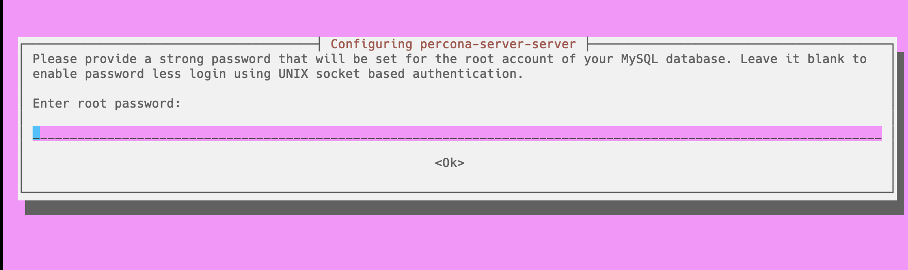
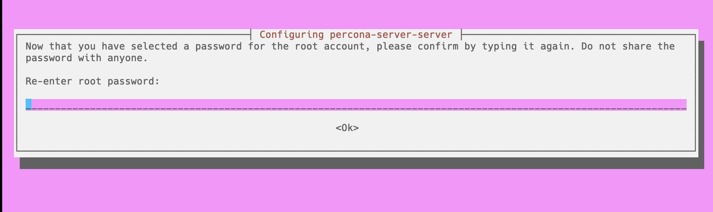
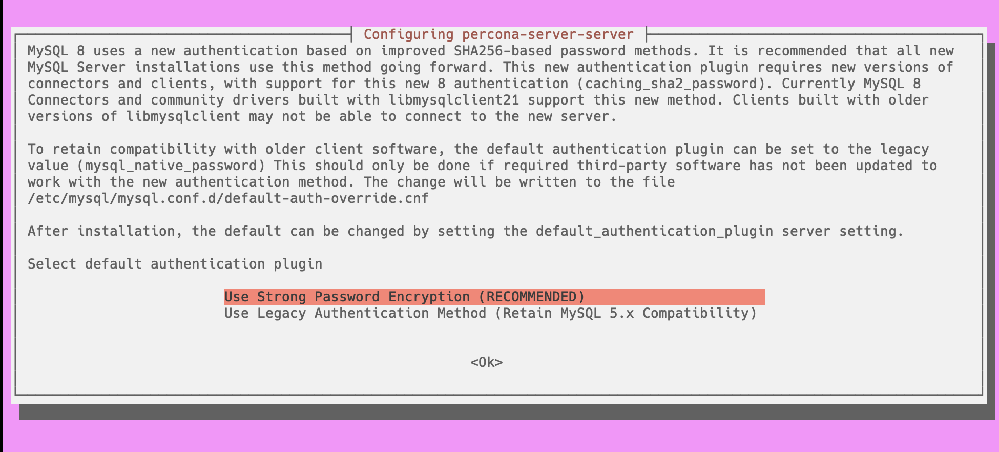

# Install with APT

Use the Percona repositories to install using APT.

## Prerequisits

* Either use `sudo` or run as root

* Stable Internet access

## Installation steps

The examles of the "expected output" depend on the operating system. The following examples are based on Ubuntu 22.04.
{.power-number}

1. Update the package index.

    ```{.bash data-prompt="$"}
    $ sudo apt update
    ```

    The result depends on the operating system. The following result is based on Ubuntu 22.04:

    ??? example "Expected output"

            ```{.text .no-copy}
            Hit:1 http://us.archive.ubuntu.com/ubuntu jammy InRelease
            Get:2 http://us.archive.ubuntu.com/ubuntu jammy-updates InRelease [119 kB]
            Hit:3 http://us.archive.ubuntu.com/ubuntu jammy-backports InRelease
            ...
            ```

2. Install curl.

    ```{.bash data-prompt="$"}
    $ sudo apt install -y curl
    ```

    The result depends on the operating system. The following result is based on Ubuntu 22.04:

    ??? example "Expected output"

        ```{.text .no-copy}
        Reading package lists... Done
        Building dependency tree... Done
        Reading state information... Done
        ...
        ```

3. Download the `percona-release` repository package:

    ```{.bash data-prompt="$"}
    $ curl -O https://repo.percona.com/apt/percona-release_latest.generic_all.deb
    ```

    You should see the following result:

    ??? example "Expected output"

        ```{.text .no-copy}
        % Total    % Received % Xferd  Average Speed   Time    Time     Time  Current
                                        Dload  Upload   Total   Spent    Left  Speed
        100 11804  100 11804    0     0  17375      0 --:--:-- --:--:-- --:--:-- 17358

        ...
        ```

4. Install the downloaded package and any dependencies:

    ```{.bash data-prompt="$"}
    $ sudo apt install -y gnupg2 lsb-release ./percona-release_latest.generic_all.deb
    ```

    You should see the following result:

    ??? example "Expected output"

        ```{.text .no-copy}
        Reading package lists... Done
        Building dependency tree... Done
        Reading state information... Done
        Note, selecting 'percona-release' instead of './percona-release_latest.generic_all.deb'
        lsb-release is already the newest version (11.1.0ubuntu4).
        lsb-release set to manually installed.
        ...
        ```

5. Update the package listing.

    ```{.bash data-prompt="$"}
    $ sudo apt update
    ```

    The result depends on the operating system. The following result is based on Ubuntu 22.04:

    ??? example "Expected output"

        ```{.text .no-copy}
        Hit:1 http://us.archive.ubuntu.com/ubuntu jammy InRelease
        Get:2 http://repo.percona.com/percona/apt jammy InRelease [15.7 kB]
        Hit:3 http://us.archive.ubuntu.com/ubuntu jammy-updates InRelease
        Hit:4 http://us.archive.ubuntu.com/ubuntu jammy-backports InRelease
        ...
        ```

6. Set up the Percona Server for MySQL 8.0 repository:

    ```{.bash data-prompt="$"}
    $ sudo percona-release setup ps80
    ```

    The result depends on the operating system. The following result is based on Ubuntu 22.04:

    ??? example "Expected output"

        ```{.text .no-copy}
        * Disabling all Percona Repositories
        * Enabling the Percona Server 8.0 repository
        * Enabling the Percona Tools repository
        Hit:1 http://us.archive.ubuntu.com/ubuntu jammy InRelease
        Hit:2 http://us.archive.ubuntu.com/ubuntu jammy-updates InRelease
        Hit:3 http://repo.percona.com/prel/apt jammy InRelease
        ...
        ```

7. Enable the Percona Server for MySQL release.

    ```{.bash data-prompt="$"}
    $ sudo percona-release enable ps-80 release
    ```

    You should see the following result:

    ??? example "Expected output"

        ```{.text .no-copy}
        * Enabling the Percona Server 8.0 repository
        <*> All done!
        ==> Please run "apt-get update" to apply changes
        ```

8. Update the package listing.

    ```{.bash data-prompt="$"}
    $ sudo apt update
    ```

    The result depends on the operating system. The following result is based on Ubuntu 22.04:

    ??? example "Expected output"

        ```{.text .no-copy}
        Hit:1 http://us.archive.ubuntu.com/ubuntu jammy InRelease
        Get:2 http://repo.percona.com/percona/apt jammy InRelease [15.7 kB]
        Hit:3 http://us.archive.ubuntu.com/ubuntu jammy-updates InRelease
        Hit:4 http://us.archive.ubuntu.com/ubuntu jammy-backports InRelease
        ...
        ```

9. Install Percona Server for MySQL 8.0.

    ```{.bash data-prompt="$"}
    $ sudo apt install -y percona-server-server
    ```

    The result depends on the operating system. The following result is based on Ubuntu 22.04:

    ??? example "Expected output"

        ```{.text .no-copy}
        Reading package lists... Done
        Building dependency tree... Done
        Reading state information... Done
        The following additional packages will be installed:
        debsums libaio1 libdpkg-perl libfile-fcntllock-perl libfile-fnmatch-perl libmecab2
        percona-server-client percona-server-common
        Suggested packages:
        debian-keyring gcc | c-compiler binutils git bzr
        The following NEW packages will be installed:
        debsums libaio1 libdpkg-perl libfile-fcntllock-perl libfile-fnmatch-perl libmecab2
        percona-server-client percona-server-common percona-server-server
        0 upgraded, 9 newly installed, 0 to remove and 161 not upgraded.
        Need to get 172 MB of archives.
        After this operation, 612 MB of additional disk space will be used.
        ...
        ```

10. The installation asks you to enter a password. We use 'secret' for these examples, but you can use any password, but you must remember to use your password for the rest of the Quickstart.

    

11. Confirm your password.

    

12. Choose the type of authentication, based on the compatibility and the security requirements of your applications.

    The Strong password encryption uses a more secure hashing algorithm to store and verify passwords, which makes it harder for attackers to crack them.

    The Legacy authentication method uses the older and less secure hashing algorithm that was used in previous versions of MySQL.

    

13. [Optional] You can increase the security of MySQL by running`sudo mysql_secure installation`.

    After installing MySQL, you should run the `mysql_secure_installation` script to improve the security of your database server. This script helps you perform several important tasks, such as:

    - Set a password for the root user

    - Select a level for the  password validation policy

    - Remove anonymous users

    - Disable root login remotely

    - Remove the test database

    - Reload the privilege table to ensure all changes take effect immediately

    By running this script, you can prevent unauthorized access to your server and protect your data from potential threats.

    ```{.bash data-prompt="$"}
    $ sudo mysql_secure_installation
    ```

    ??? example "Expected output"

        ```{.text .no-copy}
        Securing the MySQL server deployment.

        Enter password for user root:

        VALIDATE PASSWORD COMPONENT can be used to test passwords
        and improve security. It checks the strength of password
        and allows the users to set only those passwords which are
        secure enough. Would you like to setup VALIDATE PASSWORD component?

        Press y|Y for Yes, any other key for No:

        There are three levels of password validation policy:

        LOW    Length >= 8
        MEDIUM Length >= 8, numeric, mixed case, and special characters
        STRONG Length >= 8, numeric, mixed case, special characters and dictionary                  file

        Please enter 0 = LOW, 1 = MEDIUM and 2 = STRONG: 1
        Using existing password for root.

        Estimated strength of the password: 0
        Change the password for root ? ((Press y|Y for Yes, any other key for No) :

        New password:

        Re-enter new password:

        Estimated strength of the password: 100
        Do you wish to continue with the password provided?(Press y|Y for Yes, any other key for No) :
        By default, a MySQL installation has an anonymous user,
        allowing anyone to log into MySQL without having to have
        a user account created for them. This is intended only for
        testing, and to make the installation go a bit smoother.
        You should remove them before moving into a production
        environment.

        Remove anonymous users? (Press y|Y for Yes, any other key for No) :
        Success.

        Normally, root should only be allowed to connect from
        'localhost'. This ensures that someone cannot guess at
        the root password from the network.

        Disallow root login remotely? (Press y|Y for Yes, any other key for No) :
        Success.

        By default, MySQL comes with a database named 'test' that
        anyone can access. This is also intended only for testing,
        and should be removed before moving into a production
        environment.

        Remove test database and access to it? (Press y|Y for Yes, any other key for No) :
        - Dropping test database...
        Success.

        - Removing privileges on test database...
        Success.

        Reloading the privilege tables will ensure that all changes
        made so far will take effect immediately.

        Reload privilege tables now? (Press y|Y for Yes, any other key for No) :
        Success.

        All done!
        ```

14. When the installation completes, check the service status.

    ```{.bash data-prompt="$"}
    $ sudo systemctl status mysql
    ```

    ??? example "Expected output"

        ```{.text .no-copy}
        ● mysql.service - Percona Server
             Loaded: loaded (/lib/systemd/system/mysql.service; enabled; vendor preset: enabled)
             Active: active (running) since Fri 2024-02-16 10:24:58 UTC; 3min 7s ago
            Process: 4456 ExecStartPre=/usr/share/mysql/mysql-systemd-start pre (code=exited, status=0/SUCCESS)
           Main PID: 4501 (mysqld)
             Status: "Server is operational"
              Tasks: 39 (limit: 2219)
             Memory: 371.7M
                CPU: 11.800s
             CGroup: /system.slice/mysql.service
                     └─4501 /usr/sbin/mysqld

        Feb 16 10:24:56 vagrant systemd[1]: Starting Percona Server...
        Feb 16 10:24:58 vagrant systemd[1]: Started Percona Server.
        ```

    If needed, restart the service

    ```{.bash data-prompt="$"}
    $ sudo systemctl status mysql
    ```

15. Log in to the server. Use the password that you entered during the installation process, which could be `secret`orwhatever password you have selected. You do not see the characters in the password as you type.

    ```{.bash data-prompt="$"}
    $ mysql -uroot -p
    Enter password:
    ```

    ??? example "Expected output"

        ```{.text .no-copy}
        Welcome to the MySQL monitor.  Commands end with ; or \g.
        Your MySQL connection id is 10
        Server version: 8.4.0-1 Percona Server (GPL), Release 1, Revision 238b3c02

        Copyright (c) 2009-2024 Percona LLC and/or its affiliates
        Copyright (c) 2000, 2024, Oracle and/or its affiliates.

        Oracle is a registered trademark of Oracle Corporation and/or its
        affiliates. Other names may be trademarks of their respective
        owners.

        Type 'help;' or '\h' for help. Type '\c' to clear the current input statement.

        mysql>
        ```


## Create a database

??? Example "Benefits and what to watch out for when creating databases and tables"

    Creating a database and table has the following benefits:

    - Store and organize your data in a structured and consistent way.
    - Query and manipulate your data using SQL.
    - Enforce data integrity and security using constraints, triggers, views, roles, and permissions.
    - Optimize your data access and performance using indexes, partitions, caching, and other techniques.

    When you create a table, design your database schema carefully, changing it later may be difficult and costly. You should experiment with concurrency, transactions, locking, isolation, and other issues that may arise when multiple users access the same data. You must backup and restore your data regularly, as data loss or corruption may occur due to hardware failures, human errors, or malicious attacks.

To create a database, use the `CREATE DATABASE` statement. You can optionally specify the character set and collation for the database in the statement. After the database is created, select the database using the `USE` statement or the `-D` option in the MySQL client.

```{.bash data-prompt="mysql>"}
mysql> CREATE DATABASE mydb;
```

??? example "Expected output"

    ```{.text .no-copy}
    Query OK, 1 row affected (0.01 sec)
    ```

```{.bash data-prompt="mysql>"}
mysql> use mydb;
```

??? example "Expected output"

    ```{.text .no-copy}
    Database changed
    ```

## Create a table

Create a table using the `CREATE TABLE` statement. You can specify the values for each column or use the DEFAULT keyword for columns with default values, data types, constraints, indexes, and other options.

```{.bash data-prompt="mysql>"}
mysql> CREATE TABLE `employees` (
    `id` mediumint(8) unsigned NOT NULL auto_increment,
    `name` varchar(255) default NULL,
    `email` varchar(255) default NULL,
    `country` varchar(100) default NULL,
    PRIMARY KEY (`id`)
) AUTO_INCREMENT=1;
```

??? example "Expected output"

    ```{.text .no-copy}
    Query OK, 0 rows affected, 1 warning (0.03 sec)
    ```

## Insert data into the table

Insert data into the table using the `INSERT INTO` SQL statement. This statement adds multiple records into a table in one statement.


```{.bash data-prompt="mysql>"}
mysql> INSERT INTO `employees` (`name`,`email`,`country`)
VALUES
    ("Erasmus Richardson","posuere.cubilia.curae@outlook.net","England"),
    ("Jenna French","rhoncus.donec@hotmail.couk","Canada"),
    ("Alfred Dejesus","interdum@aol.org","Austria"),
    ("Hamilton Puckett","dapibus.quam@outlook.com","Canada"),
    ("Michal Brzezinski","magna@icloud.pl","Poland"),
    ("Zofia Lis","zofial00@hotmail.pl","Poland"),
    ("Aisha Yakubu","ayakubu80@outlook.com","Nigeria"),
    ("Miguel Cardenas","euismod@yahoo.com","Peru"),
    ("Luke Jansen","nibh@hotmail.edu","Netherlands"),
    ("Roger Pettersen","nunc@protonmail.no","Norway");
```

??? example "Expected output"

    ```{.text .no-copy}
    Query OK, 10 rows affected (0.02 sec)
    Records: 10  Duplicates: 0  Warnings: 0
    ```

## Run a SELECT query

SELECT queries retrieve data from one or more tables based on specified criteria. They are the most common type of query and can be used for various purposes, such as displaying, filtering, sorting, aggregating, or joining data. SELECT queries do not modify the data in the database but can affect the performance if the query involves large or complex datasets.


```{.bash data-prompt="mysql>"}
mysql>SELECT id, name, email, country FROM employees WHERE country = 'Poland';
```

??? example "Expected output"

    ```{.text .no-copy}
    +----+-------------------+---------------------+---------+
    | id | name              | email               | country |
    +----+-------------------+---------------------+---------+
    |  5 | Michal Brzezinski | magna@icloud.pl     | Poland  |
    |  6 | Zofia Lis         | zofial00@hotmail.pl | Poland  |
    +----+-------------------+---------------------+---------+
    2 rows in set (0.00 sec)
    ```

## Run an Update query

UPDATE queries modify existing data in a table. They are used to change or correct the information stored in the database. UPDATE queries can update one or more columns and rows simultaneously, depending on the specified conditions. They may also fail if they violate any constraints or rules defined on the table.

    An example of an UPDATE query and then run a [SELECT](#select-query) with a WHERE clause to verify the update.

```{.bash data-prompt="mysql>"}
mysql> UPDATE employees SET name = 'Zofia Niemec' WHERE id = 6;
```

??? example "Expected output"

    ```{.text .no-copy}
    Query OK, 1 row affected (0.01 sec)
    Rows matched: 1  Changed: 1  Warnings: 0
    ```

```{.bash data-prompt="mysql>"}
mysql> SELECT name FROM employees WHERE id = 6;
```

??? example "Expected output"

    ```{.text .no-copy}
    +--------------+
    | name         |
    +--------------+
    | Zofia Niemec |
    +--------------+
    1 row in set (0.00 sec)
    ```

## Run an INSERT query

INSERT queries add new data to a table. They are used to populate the database with new information. INSERT queries can insert one or more rows at a time, depending on the syntax. The query may fail if it violates any constraints or rules defined on the table, such as primary keys, foreign keys, unique indexes, or triggers.

Insert a row into a table and then run a [SELECT](#select-query) with a WHERE clause to verify the record was inserted.

```{.bash data-prompt="mysql>"}
mysql> INSERT INTO `employees` (`name`,`email`,`country`)
VALUES
("Kenzo Sasaki","KenSasaki@outlook.com","Japan");
```

??? example "Expected output"

    ```{.text .no-copy}
    Query OK, 1 row affected (0.01 sec)
    ```

```{.bash data-prompt="mysql>"}
mysql> SELECT id, name, email, country FROM employees WHERE id = 11;
```

??? example "Expected output"

    ```{.text .no-copy}
    +----+--------------+-----------------------+---------+
    | id | name         | email                 | country |
    +----+--------------+-----------------------+---------+
    | 11 | Kenzo Sasaki | KenSasaki@outlook.com | Japan   |
    +----+--------------+-----------------------+---------+
    1 row in set (0.00 sec)
    ```

## Run a Delete query

DELETE queries remove existing data from a table. They are used to clean up the information no longer needed or relevant in the database. The DELETE queries can delete one or more rows at a time, depending on the specified conditions. They may also trigger cascading deletes on related tables if foreign key constraints are enforced.

Delete a row in the table and run a [SELECT](#select-query) with a WHERE clause to verify the deletion.

```{.bash data-prompt="mysql>"}
mysql> DELETE FROM employees WHERE id >= 11;
```

??? example "Expected output"

    ```{.text .no-copy}
    Query OK, 1 row affected (0.01 sec)
    ```

```{.bash data-prompt="mysql>"}
mysql> SELECT id, name, email, country FROM employees WHERE id > 10;
```

??? example "Expected output"

    ```{.text .no-copy}
    Empty set (0.00 sec)
    ```


## Troubleshooting

* Connection Issues: Double-check credentials, ensure service is running, and verify firewall configurations if applicable.

* Permission Errors: Grant necessary permissions to users using GRANT statements within the MySQL shell.

* Package Installation Issues: Refer to Percona documentation and online forums for specific error messages and solutions.

##Security best practices

* Strong Passwords: Utilize complex and unique passwords for all users, especially the root account.

* Minimize Permissions: Grant users only the privileges necessary for their tasks.

* Disable Unnecessary Accounts: Remove test accounts and unused accounts.

* Regular Backups: Implement consistent backup routines to safeguard your data.

* Keep Software Updated: Maintain Percona Server and related packages updated with security patches.

* Monitor Server Activity: Employ tools, like [Percona Monitoring and Management], and logs to monitor server activity for suspicious behavior.

## Next step

[Choose your next steps:material-arrow-right:](quickstart-next-steps.md){.md-button}


[Percona Monitoring and Management]: https://docs.percona.com/percona-monitoring-and-management