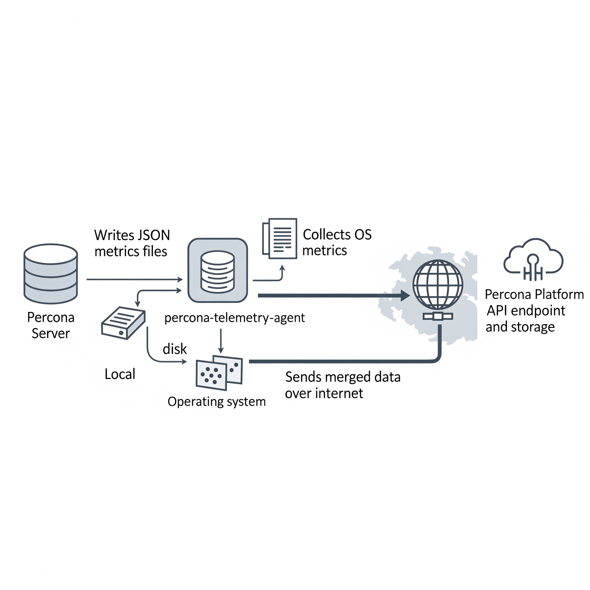

# Telemetry and data collection

Percona Server for MySQL includes two telemetry systems. Each system is optional.

* [Installation-time telemetry](#installation-time-telemetry) runs once at package install or container startup.

* [Continuous telemetry](#continuous-telemetry) uses a database (DB) component and the `percona-telemetry-agent` host process. The pair collects metrics and sends them on a daily schedule.

You control whether to share telemetry data. Disable either system, or both, when you do not want anonymous usage data sent to Percona.

Percona does not collect personal information. All telemetry data is anonymous. See the [Percona Privacy policy :octicons-link-external-16:](https://www.percona.com/privacy-policy#h.e34c40q8sb1a).

Packages, compressed archives (tarballs), and Docker images include telemetry. Tarball deployments require the telemetry agent and a writable directory under `/usr/local/percona/telemetry`.

## Telemetry overview

Telemetry reports anonymous deployment and usage metrics to Percona. Percona uses the data to prioritize fixes and feature work. Telemetry does not include database names, credentials, or user data.

## Installation-time telemetry

Installation-time telemetry runs once. The process collects host and version metadata during package installation or container startup. The process does not run again after installation completes.

### Installation-time telemetry file example

The following JSON shows a typical installation-time payload:

```json
[{"id" : "c416c3ee-48cd-471c-9733-37c2886f8231",
"product_family" : "PRODUCT_FAMILY_PS",
"instanceId" : "6aef422e-56a7-4530-af9d-94cc02198343",
"createTime" : "2026-03-26T15:43:18Z",
"metrics":
[{"key" : "deployment","value" : "PACKAGE"},
{"key" : "pillar_version","value" : "{{release}}"},
{"key" : "OS","value" : "Oracle Linux Server 10"},
{"key" : "hardware_arch","value" : "x86_64 x86_64"}]}]
```

### Disable installation-time telemetry

Installation-time telemetry is enabled by default. Set the environment variable `PERCONA_TELEMETRY_DISABLE=1` before you install packages or start a container. The variable does not disable continuous telemetry. Installation-time telemetry uses `PERCONA_TELEMETRY_DISABLE`; continuous telemetry uses the server option `percona_telemetry_disable`.

=== "Debian-derived distribution"

    ```shell
    sudo PERCONA_TELEMETRY_DISABLE=1 apt install percona-server-server
    ```

=== "Red Hat-derived distribution"

    ```shell
    sudo PERCONA_TELEMETRY_DISABLE=1 dnf install percona-server-server
    ```

=== "Docker"

    ```shell
    docker run -d -e MYSQL_ROOT_PASSWORD=test1234# -e PERCONA_TELEMETRY_DISABLE=1 --name=percona-server percona/percona-server:8.4
    ```

## Continuous telemetry

Continuous telemetry combines a Percona telemetry DB component with the `percona-telemetry-agent` service. The component writes metrics files on disk. The agent uploads the files to the Percona telemetry service. The agent waits 24 hours after startup before the first upload attempt.



### Elements of the continuous telemetry system

The continuous telemetry system includes these host-side and platform-side pieces:

| Piece | Role |
| ----- | ---- |
| Percona telemetry DB component | Collects metrics inside the server and writes a metrics file on disk |
| Metrics file | JavaScript Object Notation (JSON) file on the host that stores collected metrics |
| Telemetry agent (`percona-telemetry-agent`) | Host process that collects operating system metrics, reads metrics files, merges payloads, and queries the package manager for Percona packages |
| Telemetry service | Application programming interface (API) endpoint that receives telemetry payloads |
| Telemetry storage | Long-term storage for telemetry data on the Percona platform |

### Overview of the DB component

Percona Server for MySQL installs the telemetry DB component by default. The component registers as `file://component_percona_telemetry`.

The DB component performs these tasks:

* Collects database metrics once per day

* Writes a timestamped `.json` file under the telemetry directory

* Retains metrics files for seven days and deletes older files before creating a new file

The DB component does not collect these data types:

* Database names

* User names or credentials

* Application or user data

### Locations of metrics files and telemetry history

The telemetry root path on the host is `/usr/local/percona/telemetry`.

Product-specific directories use the following paths under the root:

| Product | Path |
| ------- | ---- |
| Percona Server for MySQL | `${telemetry root}/ps/` |
| Percona Server for MongoDB (`mongod`) | `${telemetry root}/psmdb/` |
| Percona Server for MongoDB (`mongos`) | `${telemetry root}/psmdbs/` |
| Percona XtraDB Cluster | `${telemetry root}/pxc/` |
| PostgreSQL products | `${telemetry root}/pg/` |

After a successful upload, the agent stores a copy under `${telemetry root}/history/`.

### Metrics file format

Metrics files use JSON. Percona may extend the schema in future releases. Production files can list many `active_plugins` entries. The following example shows the core fields:

```json
{
  "db_instance_id": "e83c568c-e140-11ee-8320-7e207666b18a",
  "pillar_version": "{{release}}",
  "active_plugins": [
    "binlog",
    "caching_sha2_password",
    "InnoDB",
    "PERFORMANCE_SCHEMA"
  ],
  "active_components": [
    "file://component_percona_telemetry"
  ],
  "uptime": "6185",
  "databases_count": "7",
  "databases_size": "33149",
  "se_engines_in_use": [
    "InnoDB"
  ],
  "replication_info": {
    "is_semisync_source": "1",
    "is_replica": "1"
  }
}
```

### Percona telemetry agent

The `percona-telemetry-agent` process runs on the database host. The agent manages JSON files under the telemetry root path.

The agent follows the following schedule:

* Log file path: `/var/log/percona/telemetry-agent.log`

* First 24 hours: no collection and no upload

* After 24 hours: one upload attempt per day, with up to five retries on failure

* After a successful upload: copy the file to `history/` and delete the source file from the DB component directory

* When the telemetry directory has no Percona product files: send nothing

#### Network access and corporate proxies

Continuous telemetry uploads use Hypertext Transfer Protocol Secure (HTTPS). The default endpoint is:

`https://check.percona.com/v1/telemetry/GenericReport`

Firewall teams must allow outbound HTTPS on port 443 to `check.percona.com`. Override the endpoint with `PERCONA_TELEMETRY_URL` or the `--telemetry.url` argument for `percona-telemetry-agent`.

To send traffic through a corporate proxy, add environment variables in a systemd drop-in for `percona-telemetry-agent.service`:

```ini
[Service]
Environment="HTTPS_PROXY=http://PROXY_HOST:PROXY_PORT"
Environment="NO_PROXY=localhost,127.0.0.1"
```

Apply the drop-in and restart the agent:

```shell
sudo systemctl edit percona-telemetry-agent
sudo systemctl daemon-reload
sudo systemctl restart percona-telemetry-agent
```

Replace `PROXY_HOST` and `PROXY_PORT` with your proxy hostname and port.

#### Air-gapped and isolated networks

Upload failures trigger five retries. The agent then waits until the next daily check. Unsent metrics files remain on disk until an upload succeeds.

Disk use stays bounded in isolated networks:

* The DB component retains seven days of metrics files and prunes older files before each daily write, regardless of upload status

* The agent prunes archived history on a seven-day interval (`PERCONA_TELEMETRY_HISTORY_KEEP_INTERVAL`, default 604800 seconds)

Disable continuous telemetry to stop new metrics files and outbound uploads.

#### Telemetry agent configuration

The agent reads these environment variables at startup. Restart the service after you change a value.

| Variable | Default | Description |
| -------- | ------- | ----------- |
| `PERCONA_TELEMETRY_ROOT_PATH` | `/usr/local/percona/telemetry` | Root directory for metrics and history files |
| `PERCONA_TELEMETRY_CHECK_INTERVAL` | `86400` | Seconds between upload checks |
| `PERCONA_TELEMETRY_RESEND_INTERVAL` | `60` | Seconds between retry attempts after a failed upload |
| `PERCONA_TELEMETRY_HISTORY_KEEP_INTERVAL` | `604800` | Seconds between history directory cleanup runs |
| `PERCONA_TELEMETRY_URL` | `https://check.percona.com/v1/telemetry/GenericReport` | Upload endpoint URL |

#### Telemetry agent payload example

```json
{
  "reports": [
    {
      "id": "B5BDC47B-B717-4EF5-AEDF-41A17C9C18BB",
      "createTime": "2026-03-26T15:44:54Z",
      "instanceId": "B5BDC47B-B717-4EF5-AEDF-41A17C9C18BA",
      "productFamily": "PRODUCT_FAMILY_PS",
      "metrics": [
        {
          "key": "OS",
          "value": "Ubuntu"
        },
        {
          "key": "pillar_version",
          "value": "{{release}}"
        }
      ]
    }
  ]
}
```

#### Telemetry agent payload fields

Each report object uses these fields:

| Field | Description |
| ----- | ----------- |
| `id` | Random universally unique identifier (UUID) version 4 for the request |
| `createTime` | Request timestamp |
| `instanceId` | Host ID from the metrics file, `/usr/local/percona/telemetry_uuid`, or a generated UUID version 4 when the file is absent |
| `productFamily` | Product family derived from the metrics file path, such as `PRODUCT_FAMILY_PS` |
| `metrics` | Key and value pairs from the metrics file |

#### Operating system metrics in each upload

Each upload can include these operating system keys:

| Key | Description |
| --- | ----------- |
| `OS` | Operating system name |
| `hardware_arch` | CPU architecture |
| `deployment` | Deployment method, such as `PACKAGE` or `DOCKER` |
| `installed_packages` | Installed Percona packages with name, version, and repository when available |

The agent queries the local package manager. The query matches only package names that fit Percona patterns, including `percona-*`, `Percona-*`, `proxysql*`, `pmm`, `etcd*`, `haproxy`, `patroni`, `pg*`, `postgis`, and `wal2json`. The agent does not report non-Percona packages.

## Disable continuous telemetry

Continuous telemetry is enabled by default. Complete the steps in the following order.

!!! warning "Restart required"

    Steps 1 and 3 require a server or service restart. Plan a maintenance window before you change telemetry settings in production.

1. Add the server option `percona_telemetry_disable=1` under `[mysqld]` in `my.cnf`, or in an included option file. Restart the server. The server option prevents the telemetry component from loading after restart. Do not rely on `UNINSTALL COMPONENT` alone. A restart without `percona_telemetry_disable=1` can reload telemetry.

2. Run `UNINSTALL COMPONENT "file://component_percona_telemetry";` to stop metrics file generation.

3. Stop and disable `percona-telemetry-agent` as described in [Disable the telemetry agent](#disable-the-telemetry-agent).

These steps disable continuous telemetry only. For install-time opt-out, see [Disable installation-time telemetry](#disable-installation-time-telemetry).

### Disable the telemetry agent

Stopping the agent blocks uploads. The DB component continues to write metrics files until you uninstall the component.

Run both commands for a permanent disable:

```shell
sudo systemctl stop percona-telemetry-agent
sudo systemctl disable percona-telemetry-agent
```

`systemctl stop` ends the running agent process. `systemctl disable` prevents the agent from starting at boot.

To pause the agent until the next host reboot, run `sudo systemctl stop percona-telemetry-agent` only. Do not run `disable` when you plan to re-enable the agent after reboot.

#### Agent dependencies and removal

The telemetry agent is a mandatory package dependency for Percona Server for MySQL. Review package dependencies before you remove the agent.

Package manager behavior differs:

* DNF can remove the agent when you remove the last dependent package. Removing the agent alone can remove Percona Server for MySQL when dependencies require the agent.

* APT may keep the agent after you remove only the server package. Use `apt autoremove` when appropriate. Removing the agent without checking dependencies can affect the server package.

### Verify continuous telemetry is disabled

Run these checks from the MySQL client and on the host.

Confirm the telemetry component is absent:

```sql
SELECT component_urn
FROM mysql.component
WHERE component_urn LIKE '%telemetry%';
```

??? example "Expected output when telemetry is disabled"

    ```{.text .no-copy}
    Empty set (0.00 sec)
    ```

Confirm the disable option is set:

```sql
SHOW GLOBAL VARIABLES LIKE 'percona_telemetry_disable';
```

??? example "Expected output when telemetry is disabled"

    ```{.text .no-copy}
    +---------------------------+-------+
    | Variable_name             | Value |
    +---------------------------+-------+
    | percona_telemetry_disable | ON    |
    +---------------------------+-------+
    1 row in set (0.00 sec)
    ```

Confirm the agent is inactive on the host:

```shell
systemctl is-enabled percona-telemetry-agent
systemctl is-active percona-telemetry-agent
```

After a permanent disable, `is-enabled` returns `disabled` and `is-active` returns `inactive`.

### Disable the DB component

The DB telemetry component can write metrics files for seven days while the agent is stopped. Uninstall the component after you set `percona_telemetry_disable=1` and restart the server. See the ordered steps in Disable continuous telemetry.

```sql
UNINSTALL COMPONENT "file://component_percona_telemetry";
```

Add `percona_telemetry_disable=1` to `my.cnf` when the line is missing, then restart:

```ini
[mysqld]
percona_telemetry_disable=1
```

## Related reading

* [Install Percona Server for MySQL](installation.md)

* [Running Percona Server for MySQL in a Docker container](docker.md)

* [UNINSTALL COMPONENT](uninstall-component.md)
